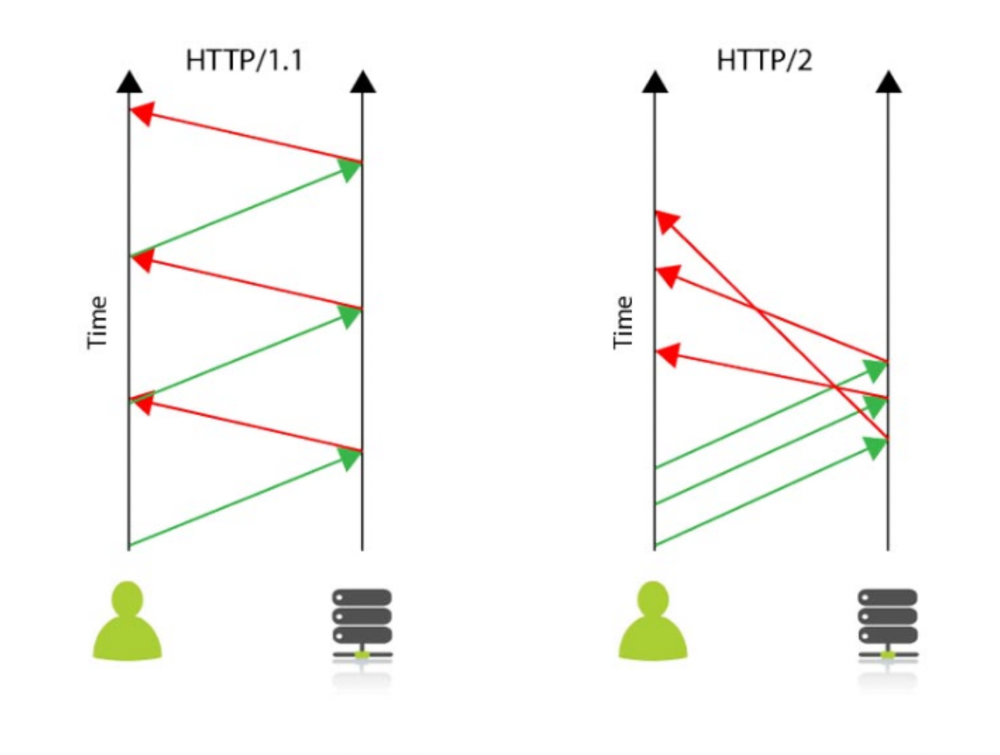

# HTTP

> 출처 [블로그](https://hanamon.kr/%EB%84%A4%ED%8A%B8%EC%9B%8C%ED%81%AC-http-http%EB%9E%80-%ED%8A%B9%EC%A7%95-%EB%AC%B4%EC%83%81%ED%83%9C-%EB%B9%84%EC%97%B0%EA%B2%B0%EC%84%B1/)을 보고 정리한 내용입니다.

## HTTP란

-   하이퍼 텍스트 전송 프로토콜 (HyperText Transfer Protocol)이다.
-   웹 페이지를 방문할 때마다 컴퓨터는 HTTP를 사용하여 서버에서 해당 페이지를 다운로드한다.
-   WWW(월드 와이드 웹)에 내재된 프로토콜이다.

## 프로토콜이란

-   프로토콜은 규칙이란 의미이다.
-   컴퓨터 네트워크에서 데이터를 주고받을 때 이러한 규칙에 맞춰 개발해 서로 정보를 교환한다.

## WWW란

-   웹 페이지를 네트워크 상에서 이용하기 위한 구조이다.
-   WWW는 실험실에서 파일을 교환하기 위해 만들어져 HTTP 프로토콜에 기초하여 실행된다.
-   다음 4가지로 구성된다.
    -   하이퍼텍스트 문서를 표현하기 위한 텍스트 형식의 언어 및 파일인 HTML
    -   인터넷 상에서 문서를 교환하기 위한 프로토콜 HTTP
    -   문서를 디스플레이하기 위한 웹 브라우저
    -   문서에 접근하도록 해주는, HTTP를 지원하는 서버

## HTTP의 특징

-   클라이언트 서버 구조
-   무상태 프로토콜(stateless)
-   비 연결성(connectionless)
-   HTTP 메세지(블로그에 포함 안됨)
-   단순함, 확장 가능(블로그에 포함 안됨)

### 1. 클라이언트 서버 구조

클라이언트가 서버에 요청을 보내면 서버는 그에 대한 응답을 보내는 클라이언트 서버 구조로 이루어진다.

-   request response 구조
-   클라이언트가 서버에 요청을 보내고 응답을 대기
-   서버는 요청에 대한 결과를 만들어 응답

### 2. 무상태 프로토콜 - stateless

서버가 클라이언트의 상태를 보존하지 않는 무상태 프로토콜이다.

-   장점 : 서버 확장성이 높음
-   단점 : 클라이언트가 추가 데이터를 전송해야 함

### 3. 비 연결성 - connectionless

HTTP는 연결을 유지하지 않는 모델이다.(HTTP 1.0 기준)

-   장점 : 초 단위 이하의 빠른 속도로 응답
    -   트래픽이 많지 않고, 빠른 응답을 제공할 수 있는 경우에 효율적으로 작동한다. ex) 1시간동안 수천 명이 서비스를 사용해도 실제 서버에서 동시에 처리하는 요청은 수십 개로 작다.
-   단점 : 트래픽이 많고 큰 규모의 서비스를 운영할 때는 한계를 보인다.
    -   연결이 끊어짐에 따라 새로 연결할 때 TCP/IP 연결을 새로 맺어야 하므로 3-way handshake에 따른 시간이 추가된다.

현재는 HTTP 지속 연결(Persisten Connections)로 문제를 해결했다.

## HTTP/1.1 vs HTTP/2

HTTP 1.1

-   connection 1개 당 하나의 요청을 처리하도록 설계됐다.
    -   동시에 리소스를 주고 받을 수 없다.
    -   요청과 응답이 순차적으로 이루어진다.
    -   요청할 리소스의 개수에 비례해 latency(대기시간)이 길어진다.

HTTP 2

-   connection 한 개로 동시에 여러 개의 메시지를 주고 받을 수 있으며, 응답은 순서에 상관없이 stream으로 주고 받는다.

## HTTP vs HTTPS

HTTPS는 80번 포트를 사용하는 HTTP와 다르게 443번 포트르 사용하며 보안을 위해 두 암호화를 지원한다.

-   대칭키 암호화
    -   클라이언트와 서버가 동일한 키를 사용해 암호화/복호화를 진행
    -   키가 노출되면 위험하지만 연산 속도가 빠름
-   비대칭키 암호화
    -   클라이언트와 서버가 1쌍으로 구성된 공개키와 개인키를 암호화/복호화에 사용
    -   키가 노출되어도 비교적 안전하지만 연산 속도

https 는 암호화 과정이 추가되어 보안에 강하지만 속도 면에서 다소 느리다.(현재에는 거의 차이가 없다.)
개인 정보와 같은 데이터를 주고 받는 경우가 아니라면 HTTP를 사용해도 무방하다.
