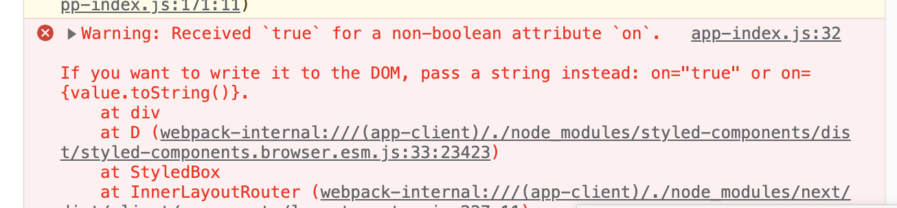

# attribute

> 출처 [블로그](https://mygumi.tistory.com/382)을 보고 정리한 내용입니다.

(태그의 attribute가 무엇인가에 대한 내용이 아닌, 개발을 하면서 만나게 된 오류와 해당 오류가 발생한 원인을 파악하며 알아간 내용을 정리했습니다.)

styled component로 스타일링을 하다보면 가끔씩 만나게 되는 오류가 있다.



위 오류는 불리언 타입이 아닌 속성에 불리언 타입이 할당되었으니 타입을 스트링형태로 변환하라는 내용이다.

해당 오류는 styled component 패키지와 관련이 있다. 이에 대해 말하기에 앞서 알고 있어야 하는 개념이 있다.

div 태그의 hidden, id, class, img 태그의 width, height, src, alt등과 같이 태그 자체가 가지는 속성들을 html 표준 속성이라고 한다.(https://developer.mozilla.org/ko/docs/Web/HTML/Attributes)

이제 아래 코드 예시를 보자.

```js
import styled from "styled-components";

const Div1 = styled.div < { hidden: boolean } > ``;
const Div2 = styled.div < { doneIsDone: boolean } > ``;

export default function App() {
    return (
        <div>
            <Div1 on={true}>Div1</Div1>
            <Div2 abc={true}>Div2</Div2>
        </div>
    );
}
```


위 코드를 실행하면 Div1 태그에 대해서만 에러를 출력하고 있는데 이는 style component에서 비표준 속성은 자동으로 필터링하기 때문이다. abc는 필터링 대상으로 노출이 되지 않아 오류를 출력하는 것이다.
