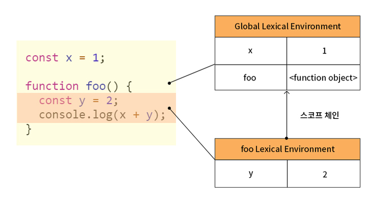

# 실행컨텍스트

> 출처 [모던 JavaScript 튜토리얼](https://ko.javascript.info/),Modern JavaScript Deep Dive을 보고 정리한 내용입니다.

## 소스코드의 평가와 실행

자바스크립트 엔진은 1. 소스코드의 평가 2. 소스코드의 실행의 과정으로 분리하여 처리한다.

1. 소스코드의 평가 - 실행 컨텍스트를 생성하고 변수, 함수 등,의 선언문만 먼저 실행하여 생성된 변수나 함수 식별자를 키로 실행 컨텍스트가 관리하는 스코프에 등록한다.

2. 소스코드 평가의 과정이 끝나고 실행에 필요한 정보, 즉 변수나 함수의 참조를 실행 컨텍스트가 관리하는 스코프에서 검색하여 취득한다.

실행 중인 함수의 실행 절차에 대한 정보는 해당 함수의 실행 컨텍스트(execution context)에 저장된다.

```js
var x; // 소스코드의 평가 단계에서 실행 컨텍스트가 관리하는 스코프에 x를 등록하고 undefined으로 초기화한다.

x = 1; // 소스코드의 실행 단계에서 x변수가 선언된 변수인지 확인한다. 즉 실행 컨텍스트에 등록되어 있는지 확인하고 1이라는 값을 할당하여 실행 컨텍스트에서 관리한다.
```

---

## 실행 컨텍스트의 역할

1. 선언에 의해 생성된 모든 식별자(변수, 함수, 클래스 등)는 스코프를 구분하여 등록하고 상대 변화를 지속적으로 관리

2. 스코프는 중첩 관계에 의해 스코프 체인을 형성하여 스코프 체인을 통해 상위 스코프로 이동하며 식별자를 검색할 수 있어야 함

3. 실행 중인 코드의 실행 순서를 변경(함수 호출에 의한 실행 순서 변경)하고 다시 되돌아갈 수 있어야 함

실행 컨텍스트는 소스코드를 실행하는 데 필요한 환경을 제공하고 코드의 실행 결과를 실제로 관리하는 영역이다.

구체적으로 실행 컨텍스트는 식별자를 등록하고 관리하는 스코프와 코드 실행 순서 관리를 구현한 메커니즘으로 모든 코드는 실행 컨텍스트를 통해 실행되고 관리된다.

식별자와 스코프는 실행 컨텍스트의 렉시컬 환경으로 관리하고 코드 실행 순서는 실행 컨텍스트 스택으로 관리한다.

---

## 실행 컨텍스트 스택

실행 컨텍스트 스택은 코드의 실행 흐름을 관리한다. 소스코드가 평가되면 실행 컨텍스트가 생성되고 스택의 최상위에 쌓인다. 실행 컨텍스트 스택 최상위에 있는 스택은 언제나 현재 실행중인 스택이다.

---

## 렉시컬 환경

렉시컬 환경은 키와 값을 갖는 객체 형태의 스코프를 생성하여 식별자를 키로 등록하고 식별자에 바인딩된 값을 관리한다.



렉시컬 환경은 두 가지로 구성된다.

1. 환경 레코드 : 스코프에 포함된 식별자를 등록하고 등록된 식별자에 바인딩된 값을 관리하는 저장소이다.

2. 외부 렉시컬 환경에 대한 참조 : 이는 상위 스코프를 가리킨다. 즉, 해당 실행 컨텍스트를 생성한 소스코드를 포함하는 상위 코드의 렉시컬 환경을 말한다.

---

## 실행 컨텍스트의 생성과 식별자 검색 과정

1. 전역 실행 컨텍스트 생성

2. 전역 렉시컬 환경 생성

    - 전역 환경 레코드 생성
        - 전역 환경 레코드는 전역 변수를 관리하는 전역 스코프, 전역 객체의 빌트인 전역 프로퍼티와 빌트인 전역 함수, 표준 빌트인 객체를 제공한다.
        - var 키워드로 선언한 변수와 다르게 let,const로 선언한 변수는 전역 객체의 프로퍼티가 아닌 개념적인 블록 내에 존재한다. 이 두가지를 분리하기 위해 전역 환경 레코드는 객체 환경 레코드, 선언적 환경 레코드로 구성된다.
    - this 바인딩
        - 전역 환경 레코드의 [[GlobalThisValue]] 내부 슬롯에 this가 바인딩된다.
    - 외부 렉시컬 환경에 대한 참조 결정
    - 전역 코드 실행
