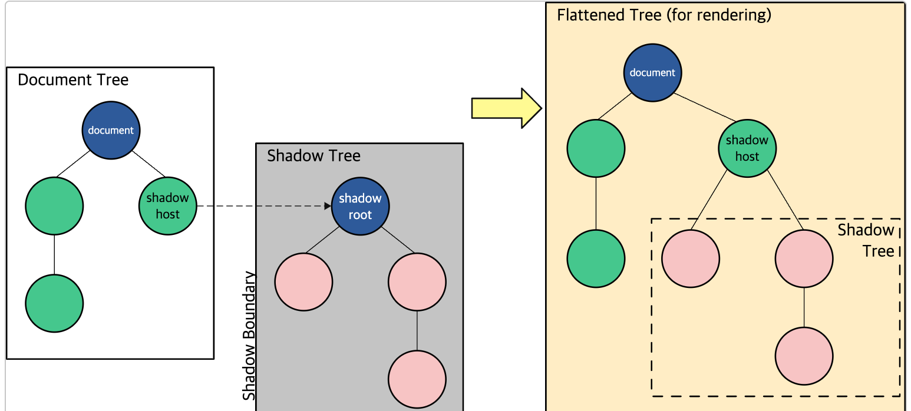

# 웹컴포넌트

> 출처 [웹 컴포넌트 mdn](https://developer.mozilla.org/ko/docs/Web/API/Web_components)을 보고 정리한 내용입니다.

회사에서 React가 아닌 Vanilla JS로 개발을 진행해야 하는 업무를 맡았다.

React에선 익숙한 컴포넌트 개념을 Vanilla JS로는 어떻게 구현할 수 있는지를 탐구하는 과정에서 새롭게 익히게 된 웹 컴포넌트라는 개념을 정리했다.

MDN에서는 다음과 같이 웹 컴포넌트의 정의를 설명했다. - '세 가지 주요 기술들로 구성되며, 재사용을 원하는 어느곳이든 코드 충돌에 대한 걱정이 없는 캡슐화된 기능을 갖춘 다용도의 커스텀 엘리먼트를 생성하기 위해 함께 사용될 수 있습니다.'

여기서 말하는 세 가지 주요 기술은 아래와 같다.

-   Custom elements
-   Shadow DOM
-   HTML 템플릿

## [Custom elements](https://developer.mozilla.org/ko/docs/Web/API/Web_components/Using_custom_elements)

커스텀 엘리먼트는 두 가지가 존재한다.

-   독립적인 커스텀 엘리먼트 : 표존 HTML 요소(div, button, input ...)를 상속받지 않고 HTML 요소로 작성됨.

(예시)

```js
document.createElement("popup-info");
```

-   커스텀된 내장 엘리먼트 : 기본 HTML 요소를 상속받음. is 특성에 커스텀 엘리먼트의 이름을 명시해야 함.

(예시)

```html
<p is="word-count"></p>
```

혹은

```js
document.createElement("p", { is: "word-count" }).
```

### 독립적인 커스텀 엘리먼트

아래 코드 스니펫은 constructor 메서드를 포함하고 있는데 이는 클래스의 인스턴스 객체를 생성하고 초기화하는 특별한 메서드이다. 다른 모든 메서드 호출보다 앞선 시점인, 인스턴트 객체를 초기화할 때 수행할 초기화 코드를 정의할 수 있다.

웹 컴포넌트에서는 항상 super()를 호출함으로써 올바른 프로토타입 체인이 확립되도록 한다.

```js
class PopUpInfo extends HTMLElement {
  constructor() {
    // 항상 super를 생성자에서 먼저 호출합니다
    super();

    // 요소 기능을 여기 작성합니다

    ...
  }
}
```

connectedCallback 안에서는 클래스의 인스턴스가 인스턴스화되었을 때 요소가 가질 모든 기능을 정의한다.

shadow root를 생성하고 엘리먼트를 부착하거나 이벤트 리스너를 정의할 수 있다.

마지막으로 웹 document에서 커스텀 엘리먼트의 컨트롤러인 CustomElementRegistry 객체로 커스텀 엘리먼트를 등록한다.

아래에서 customElements.define이 이에 해당한다.

```js
class WordCount extends HTMLParagraphElement {
  constructor() {
    super();

    ...
  }
}

customElements.define('word-count', WordCount, { extends: 'p' });
```

### 내부 스타일 vs 외부 스타일

두 가지 스타일 방식이 있다.

1. style 태그를 사용하기

```js
class Box extends HTMLElement {
    constructor() {
        super();
    }

    connectedCallback() {
        const style = document.createElement("style");
        style.textContent = "
          // css 코드 작성
        ";
        this.shadowRoot.append(style, wrapper);
    }
}
```

2. link 태그를 사용하기 (코드 예시 - https://github.com/mdn/web-components-examples/blob/main/popup-info-box-external-stylesheet/main.js)

가독성과 관심사 분리를 위해서라도 link 태그 사용을 추천하고 싶다.

## 생명 주기 콜백

-   connectedCallback: 커스텀 엘리먼트가 DOM에 연결된 엘리먼트에 추가될 때마다 호출한다. 이것은 노드가 이동될 때마다 발생하고, 엘리먼트가 완전히 파싱되기 전에 발생할 수 있다.(connectedCallback 은 엘리먼트가 더 이상 연결되지 않았을 때 호출될 수도 있으므로, 확실하게 하기 위해선 Node.isConnected (en-US)를 사용해야 한다.)
-   disconnectedCallback: 커스텀 엘리먼트가 document의 DOM에서 연결 해제되었을 때마다 호출된다.
-   adoptedCallback: 커스텀 엘리먼트가 새로운 document로 이동되었을 때마다 호출된다.
-   attributeChangedCallback: 커스텀 엘리먼트의 특성들 중 하나가 추가되거나, 제거되거나, 변경될 때마다 호출된다. 어떤 특성이 변경에 대해 알릴지는 static get observedAttributes 메서드에서 명시해야 한다.

### 트랜스파일러 vs 클래스

class를 사용하여 커스텀 엘리먼트 객체를 만들었다. 이때 class는 표준 ES 2015 class 구문을 사용한다. (tsconfig.json 파일에서 옵션 중 target을 es6 미만으로 하면 에러가 난다.)

---

## Shadow DOM 사용하기

Shadow DOM은 웹 컴포넌트의 핵심인 캡슐화를 구현한다. Shadow DOM은 숨겨진 DOM 트리를 DOM 트리(웹 페이지에 대한 통상적인 인터페이스)에 부착할 수 있게 한다. 이때 shadow dom 트리는 shadow root로부터 시작한다.



위 사진의 이해를 돕기 위해 몇 가지 용어에 대한 이해가 필요하다.

-   shadow host : shadow dom이 부착되는 DOM 노드
-   shadow tree : shadow dom 내부의 dom 트리
-   shadow boundary : shadow dom이 끝나고 통상적인 dom이 시작되는 장소
-   shadow root: shadow tree의 루트 노드

shadow dom은 자식 노드를 추가하거나 스타일을 추가한다던지 기존 dom과 다를 바 없이 동작한다. 다만 차이점은 shadow dom 내부의 코드는 외부 dom에 영향을 주지 않음으로서 캡슐화를 구현한다.

shadow dom은 기존에 없던 새로운 기술처럼 보이지만 실제로는 우리에게 친숙한 기술이다. 예를 들어 <video/> 태그는 dom에서 보이는 것은 <video />가 전부이지만 실제로는 여러 버튼과 내부에 구현된 동작 방식이 존재한다.

### 사용법

Element.attachShadow() 메서드를 사용하여 어떠한 요소에든 shadow root를 부착할 수 있다. (여기에서 말하는 [Element](https://developer.mozilla.org/ko/docs/Web/API/Element)는 Document 안의 모든 객체가 상속하는 제일 범용적인 기반 클래스이다. 따라서 웹컴포넌트를 선언하는 class는 HTMLElement를 상속받는다.)

```js
class WebComponent extends HTMLElement {
    constructor() {
        // Always call super first in constructor
        super();

        let shadow = elementRef.attachShadow({ mode: "open" });
    }
}
```

위의 예시에서 옵션 mode는 'open' 값을 가지고 있는데 메인 페이지 맥락에서 작성된 javascript로 shadow dom에 접근할 수 있음을 의미한다. (ex : let myShadowDom = myCustomElem.shadowRoot;)

```js
class Sample extends HTMLElement {
    constructor() {
        super(); // 항상 최상단에 존재해야 한다. 올바른 프로토타입 체인을 형성하는데 필요하다.

        const shadow = this.attachShadow({ mode: "open" }); // shadow root를 생성

        const wrapper = document.createElement("span"); // shadow root에 부착할 엘리먼트 생성
        const style = document.createElement("style");
        style.textContent = `
            .wrapper {
                background: blue;
            }
        `;

        shadow.appendChild(style); // 생성한 요소를 shadow root에 부착
        shadow.appendChild(wrapper);
    }
}

customElements.define("sample-webcomponent", Sample); // 생성한 custom element를 페이지에 추가하기
```

---
