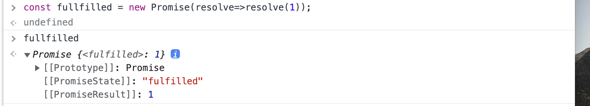

# 프로미스

> 출처 Modern JavaScript Deep Dive를 보고 정리한 내용입니다.

자바스크립트는 비동기 처리를 위한 한 형태로 콜백 함수를 사용한다.

콜백이란 다른 함수의 전달인자로 넘겨주는 함수를 말한다.

비동기 함수는 함수 내부의 비동기로 동작하는 코드가 완료되지 않았다 해도 기다리지 않고 즉시 종료된다.

즉, 비동기 함수 내부의 비동기로 동작하는 코드는 비동기 함수가 종료된 이후에 완료된다.

```js
let g = 0;

setTimeout(() => {
    g = 100;
}, 0);
console.log(g); // 0
```

아래 예시는 비동기 함수에서의 처리 결과를 상위 스코프의 변수에 할당한 경우에 기대한 대로 동작하지 않는다.

```js
const get = (url) => {
    const xhr = new XMLHttpRequest();
    xhr.open("GET", url);
    xhr.send();

    xhr.onload = () => {
        if (xhr.status === 200) {
            return JSON.parse(xhr.response);
        }
        console.error(`${xhr.status} ${xhr.statusText}`);
    };
};

const response = get("https://jsonplaceholder.typicode.com/posts/1");
console.log(response); // undefined
```

get 함수가 호출되면 HTTP 요청을 전송한다.

xhr의 onload 이벤트 핸들러 프로퍼티에 바인딩한 이벤트 핸들러의 반환문은 get 함수의 반환문이 아니다.

get 함수의 반환문은 없으므로 undefined를 반환한다.

이번에는 비동기함수의 처리결과를 비동기 함수 내부에서 상위 스코프에 할당해보자.

```js
let todos;

const get = (url) => {
    const xhr = new XMLHttpRequest();
    xhr.open("GET", url);
    xhr.send();

    xhr.onload = () => {
        if (xhr.status === 200) {
            todos = JSON.parse(xhr.response);
        } else {
            console.error(`${xhr.status} ${xhr.statusText}`);
        }
    };
};

get("https://jsonplaceholder.typicode.com/posts/1");

console.log(todos); // undefined
```

이 또한 기대한 대로 동작하지 않는다. 비동기함수 get을 호출하면 함수 코드를 평가하는 과정에서 get 함수의 실행 컨텍스트가 생성되고 실행 컨텍스트 스택(콜 스택)에 푸시된다. 이후 xhr.onload 이벤트 헨들러 프로퍼티에 이벤트 핸들러가 바인딩된다.

get 함수가 종료하면 곧바로 console.log가 호출되고 이때 console.log의 실행 컨텍스트가 생성되어 실행 컨텍스트 스택에 푸시된다. 만약 console.log 가 호출되기 이전에 load 이벤트가 발생했더라도 xhr.onload 이벤트 핸들러 프로퍼티에 바인딩한 이벤트 핸들러는 console.log보다 먼저 실행되지 않는다.

1. 서버로부터 응답이 도착하면 xhr 객체에서 load 이벤트가 발생

2. xhronload 이벤트 핸들러는 테스크 큐에 저장되어 대기

3. 콜 스택이 비면 이벤트 루프에 의해 콜 스택으로 푸시되어 실행

의 과정을 거치기 때문에 이벤트 핸들러가 실행되는 시점은 콜 스택이 빈 상태여야 하므로 console.log 함수는 이미 실행 종료된 이후이다.

이처럼 비동기 함수는 비동기 처리 결과를 외부에 반환할 수 없고, 상위 스코프의 변수에 할당할 수 없다.

따라서 비동기 함수의 처리 결과에 대한 후속 처리는 비동기 함수 내부에서 후속 처리를 위한 콜백 함수를 전달해야 한다.

```js
const get = (url, successCallback, failureCallbak) => {
    const xhr = new XMLHttpRequest();
    xhr.open("GET", url);
    xhr.send();

    xhr.onload = () => {
        if (xhr.status === 200) {
            successCallback(JSON.parse(xhr.response));
        } else {
            failureCallbak(xhr.status);
        }
    };
};

get("https://jsonplaceholder.typicode.com/posts/1", console.log, console.error);
```

이처럼 비동기 함수의 비동기 처리에 대한 콜백 함수와 에러 처리 함수를 전달하는 방식은 가독성, 에러처리, 모두 불편하다.

---

## Promise

ES6에서는 비동기 처리를 위한 다른 형태로 프로미스(PROMISE)를 도입했다.

PROMISE 생성자 함수는 비동기 처리를 수행할 콜백 함수를 인수로 전달받는데 이 콜백 함수는 resolve 와 reject함수를 인수로 전달받는다.

```js
const promise = new Promise((resolve,reject) =>{
    if(
        // 비동기 처리 성공
    ){
        resolve('result');
    }else{
        reject("failure reason");
    }
})

```

프로미스는 다음과 같이 현재 비동기 처리가 어떻게 진행되고 있는지를 나타내는 상태 정보를 갖는다.

| 프로미스의 상태 정보 | 의미                             | 상태 변경 조건                   |
| -------------------- | -------------------------------- | -------------------------------- |
| pending              | 비동기 처리가 수행되지 않은 상태 | 프로미스가 생성된 직후 기본 상태 |
| fulfilled            | 비동기 처리가 수행된 상태(성공)  | resolve 함수 호출                |
| rejected             | 비동기 처리가 수행된 상태(실패)  | reject 함수 호출                 |

비동기 처리 성공 예시



비동기 처리 실패 예시


두 사진을 보면 프로미스 객체는 [[PromiseState]] 내부 슬롯에 프로미스의 비동기 처리 여부에 따른 상태정보와 [[PromiseResult]] 슬롯에 함수 처리 결과의 반환값을 갖는다.

즉 프로미스는 비동기 처리 상태와 처리 결과를 갖는다.

## 프로미스의 후속 처리 메서드

프로미스는 비동기 처리 상태가 변화하면 이에 따른 후속 처리를 한다.

### Promise.prototype.then

then 메서드는 두 개의 콜백 함수를 인수로 전달받아 비동기 처리 상태가 변화하면 후속 처리 메서드에 인수로 전달한 콜백 함수가 선택적으로 호출된다.

-   첫 번째 콜백 함수는 프로미스가 fulfilled 상태가 되면 호출되며 콜백 함수는 프로미스의 비동기 처리 결과를 인수로 받는다.
-   두 번째 콜백 함수는 프로미스가 rejected 상태가 되면 호출되며 프로미스의 에러를 인수로 받는다.

```js
//fulfilled
new Promise((resolve) => resolve("fulfilled")).then(
    (v) => console.log(v),
    (e) => console.error(e)
); // fulfilled
// rejected
new Promise((_, reject) => reject("rejected")).then(
    (v) => console.log(v),
    (e) => console.error(e)
); // Error: rejected
```

### Promise.prototype.catch

catch 메서드는 Promise가 rejected 상태인 경우에만 동작한다.

```js
// rejected
new Promise((_, reject) => reject("rejected")).catch((e) => console.error(e)); // Error: rejected

//이는 아래와 동일하게 동작한다.
new Promise((_, reject) => reject("rejected")).then(
    (v) => console.log(v),
    (e) => console.error(e)
); // Error: rejected
```

### Promise.prototype.finally

finally 메서드는 한 개의 콜백 함수를 인수로 전달하고 프로미스의 성공과 실패에 관련없이 무조건 호출된다.

따라서 프로미스의 상태와 관련없이 반드시 실행되어야 하는 경우에 유용하다.

```js
new Promise(() => {}).finally((v) => console.log("finally"));
```

### 프로미스의 에러처리

비동기 처리에서 발생한 에러는 then 메서드의 2번째 콜백 함수로 처리하거나 catch 메서드로 처리할 수 있다.

```js
new Promise((_, reject) => reject("rejected")).then(
    (v) => console.log(v),
    (e) => console.error(e)
); // Error: rejected

new Promise((_, reject) => reject("rejected"))
    .then((v) => console.log(v))
    .catch((e) => console.error(e)); // Error: rejected
```

단, then 메서드로 에러 처리를 하면 then 메서드의 첫 번째 인수인 콜백 함수에서 발생한 에러를 캐치하지 못하고 가독성이 좋지 않다.

따라서 catch 메서드를 사용해 에러 처리를 하는 것이 권장된다.
