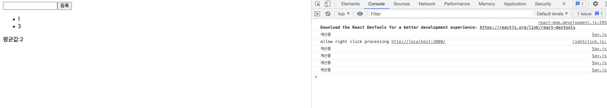
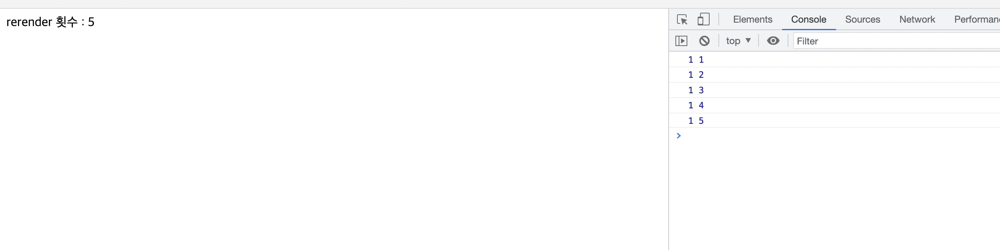

# hook

> 출처 [리액트를 다루는 기술](http://www.kyobobook.co.kr/product/detailViewKor.laf?mallGb=KOR&ejkGb=KOR&barcode=9791160508796)을 보고 정리한 내용입니다.

hook은 리액트 v16.8에 새로 도입되어 함수 컴포넌트에서도 상태 관리를 할 수 있는 useState, 렌더링 직후 작업을 설정하는 useEffect등의 기능을 제공한다.

## useEffect

useEffect는 componentDidMount, componentDidUpdate, componentWillUnmount 가 합쳐진 기능이라고 생각해도 좋다.

## useReducer

useReducer Hook은 useState와 유사한데 좀 더 복잡한 로직과 상태관리에 사용된다.

쓸 일이 생길 것 같다.

```js
// 예시 1, 가독성이 있어 좋은듯
import { useReducer } from "react";

function reducer(state, action) {
    switch (action.type) {
        case "INCREMENT":
            return { value: state.value + 1 };
        case "DECREMENT":
            return { value: state.value - 1 };
        default:
            return state;
    }
}

const Counter = () => {
    const [state, dispatch] = useReducer(reducer, { value: 0 });

    return (
        <div>
            <button onClick={() => dispatch({ type: "INCREMENT" })}>
                증가
            </button>
            <button onClick={() => dispatch({ type: "DECREMENT" })}>
                감소
            </button>
            <span>{state.value}</span>
        </div>
    );
};
export default Counter;
```

```js
// 예시 2, input이 많아도 코드를 짧고 깔끔하게 유지 가능.
import { useReducer } from "react";

function reducer(state, action) {
    return {
        //단, ...state가 위에 있어야 한다.
        ...state,
        [action.name]: action.value,
    };
}

const Info = () => {
    const [state, dispatch] = useReducer(reducer, {
        name: "",
        nickname: "",
    });

    const { name, nickname } = state;

    const onChange = (e) => {
        dispatch(e.target);
    };

    return (
        <div>
            <div>
                <input name="name" value={name} onChange={onChange}></input>
                <input
                    name="nickname"
                    value={nickname}
                    onChange={onChange}
                ></input>
            </div>
            <div>이름:{name}</div>
            <div>닉네임:{nickname}</div>
        </div>
    );
};
export default Info;
```

## useMemo

useMemo hook은 함수 컴포넌트 내부에서 발생하는 연산을 최적화한다.

```js
import { useMemo, useState } from "react";

const getAverage = (numbers) => {
    console.log("계산중");
    if (numbers.length === 0) return 0;
    const sum = numbers.reduce((a, b) => a + b);
    return sum / numbers.length;
};

const Average = () => {
    const [list, setList] = useState([]);
    const [number, setNumber] = useState("");

    const onChange = (e) => {
        setNumber(e.target.value);
    };

    const onInsert = () => {
        const nextList = list.concat(parseInt(number));

        setList(nextList);
        setNumber("");
    };
    // const avg = useMemo(() => getAverage(list), [list]);

    return (
        <div>
            <input value={number} onChange={onChange}></input>
            <button onClick={onInsert}>등록</button>
            <ul>
                {list.map((value, index) => (
                    <li key={index}>{value}</li>
                ))}
            </ul>
            <div>평균값:{getAverage(list)}</div>
        </div>
    );
};
export default Avereage;
```


 
위 코드는 입력받은 값들의 평균을 보여준다.

만약 주석처리한 useMemo hook을 이용한 avg값을 평균값 위치에 사용하지 않고 코드처럼 jsx에 getAverage함수를 두게 되면 매번 리렌더링이 될때마다 함수를 실행하게 된다.

이는 불필요하게 input이 등록될 때가 아닌 값이 변경될 때 또한 함수가 실행되기 때문에 최적화가 필요하다.

이러한 상황에 useMemo를 사용하자.

## useCallback

useCallback hook은 렌더링 성능을 최적화해야 할 때 만들어 놨던 함수를 재사용하기 위해 사용한다.

위 코드에서 onChange와 onInsert는 컴포넌트가 리렌더링될 때마다 새로 만들어진 함수를 사용하게 된다.

대부분은 이러한 방식은 문제없지만 컴포넌트의 렌더링이 자주 발생하거나 렌더링할 컴포넌트의 개수가 많아지면 이 부분을 최적화해주는 것이 좋다.

```js
import { useCallback, useMemo, useState } from "react";

const getAverage = (numbers) => {
    console.log("계산중");
    if (numbers.length === 0) return 0;
    const sum = numbers.reduce((a, b) => a + b);
    return sum / numbers.length;
};

const Average = () => {
    const [list, setList] = useState([]);
    const [number, setNumber] = useState("");

    const onChange = useCallback((e) => {
        setNumber(e.target.value);
    }, []);

    const onInsert = useCallback(() => {
        const nextList = list.concat(parseInt(number));
        setList(nextList);
        setNumber("");
    }, [list, number]);
    const avg = useMemo(() => getAverage(list), [list]);

    return (
        <div>
            <input value={number} onChange={onChange}></input>
            <button onClick={onInsert}>등록</button>
            <ul>
                {list.map((value, index) => (
                    <li key={index}>{value}</li>
                ))}
            </ul>
            <div>평균값:{avg}</div>
        </div>
    );
};
export default Avereage;
```

## useRef

useRef는 함수 컴포넌트에서 ref를 사용할 때 외에도 컴포넌트의 로컬 변수를 사용해야 할 때 사용할 수 있다.

여기서 로컬변수는 렌더링과 관련없이 바뀔 수 있는 값을 의미한다.

```js
const id = useRef(1);

const setId = (n) => {
    id.current = n;
};
```

사용 방식은 위처럼 current속성에 값을 할당한다.

여기서 굳이 let id = 1; 이런 식으로 선언하면 되지 왜 useRef를 사용해야 하나 의문이 생겨서 이유를 찾아보았다.

이유는 리렌더링할 때마다 함수형 컴포넌트는 호출되는데 일반 자바스크립트 함수와 마찬가지로 호출될 때마다 함수 내부에 정의된 로컬 변수들을 초기화한다.

아래 예시를 보자.

```js
import { useEffect, useRef, useState } from "react";

const RefSample = () => {
    let id = 1; // 로컬 변수 선언
    const [reRender, setReRender] = useState(0);
    useEffect(() => console.log(id, reRender), [id, reRender]);
    return (
        <div
            onClick={() => {
                setReRender(reRender + 1);
                id++;
            }}
        >
            rerender 횟수 : {reRender}
        </div>
    );
};

export default RefSample;
```



로컬 변수를 사용하기 위해 useRef가 아닌 일반적으로 사용하는 방식인 let id = 1; 로 선언했다.

그리고 클릭할 때마다 reRender 변수와 id를 1씩 증가시키고 useEffect에서 console.log로 값을 확인했다.

위에서 설명했듯이 리렌더링할 때마다 함수형 컴포넌트는 호출되며 로컬 변수가 초기화된다. 따라서 id는 항상 1이다.

반면 useRef hook이 반환하는 객체는 React가 만든 전역 저장소에 저장되기 떄문에 함수를 재 호출하더라도 유지된다.

[참고](https://react.vlpt.us/basic/12-variable-with-useRef.html)
