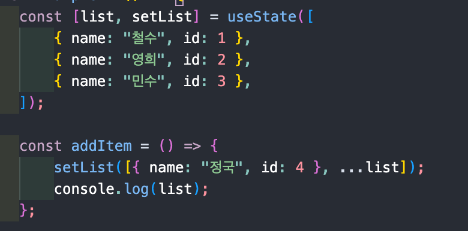

# key

> 출처 > 출처 [리액트를 다루는 기술](http://www.kyobobook.co.kr/product/detailViewKor.laf?mallGb=KOR&ejkGb=KOR&barcode=9791160508796), [블로그](https://medium.com/sjk5766/react-%eb%b0%b0%ec%97%b4%ec%9d%98-index%eb%a5%bc-key%eb%a1%9c-%ec%93%b0%eb%a9%b4-%ec%95%88%eb%90%98%eb%8a%94-%ec%9d%b4%ec%9c%a0-3ce48b3a18fb)를 보고 정리한 내용입니다.

개발을 하다 보면 종종 컴포넌트를 map 함수로 반복하여 렌더링하는 경우가 종종 생긴다.

이럴 때 키를 설정해 주지 않으면 다음과 같은 에러가 발생한다.


```html
// before
<ul>
    <li>Duke</li>
    <li>Villanova</li>
</ul>

// after
<ul>
    <li>Connecticut</li>
    <li>Duke</li>
    <li>Villanova</li>
</ul>
```

위의 경우 key값이 없기 때문에 react에서는 ul의 중복되는 자식 li 요소들 또한 다시 그린다.

렌더링 자체에는 문제가 없지만 react에서는 배열로 된 컴포넌트의 변화를 효율적으로 감지하기 위해 key값을 사용한다.

## key로 index를 사용하면 안되는 이유

아래는 key로 index를 사용하는 input 요소들을 반환하는 컴포넌트이다.

```js
import React, { useEffect, useState } from "react";

const Example = () => {
    const [list, setList] = useState([
        { name: "철수" },
        { name: "영희" },
        { name: "민수" },
    ]);

    const addItem = () => {
        setList([{ name: "정국" }, ...list]);
    };

    const delItem = () => {
        setList(list.filter((l) => l.name != "철수"));
    };

    return (
        <>
            {/* 추가 버튼과 삭제 버튼*/}
            <input type="button" value="추가" onClick={addItem} />
            <input type="button" value="삭제" onClick={delItem} />

            <h2> Show Problem Example</h2>
            {list.map((v, index) => (
                /*  div 태그의 key로 배열의 index 사용*/
                <div key={index}>
                    {v.name}, idx: {index} <input type="text" />{" "}
                </div>
            ))}
        </>
    );
};

export default Example;
```

위 코드에서 철수 input에 값을 적고 추가 버튼을 누르면 의도와는 다르게 새로 생긴 정국 항목에 값이 쓰여져있다.


추가 버튼을 누르면 컴포넌트의 useState로 선언한 list 데이터가 변경되면서 리렌더링이 된다.

React는 key가 동일한 경우 동일한 DOM Element를 보여주기 때문에 위와 같은 상황이 발생한다.

따라서 아래와 같이 항목마다 unique한 키를 사용하고 데이터의 변화가 없는 경우에 index를 키로 사용하자.


