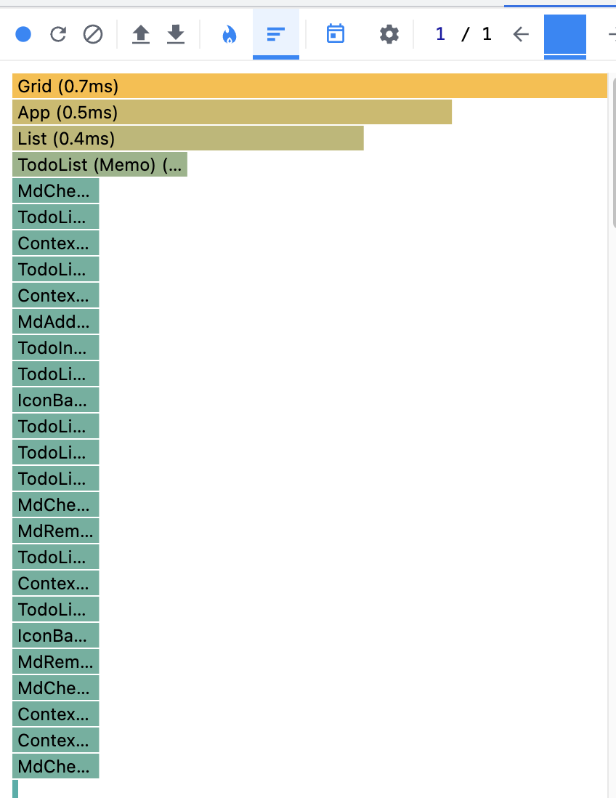
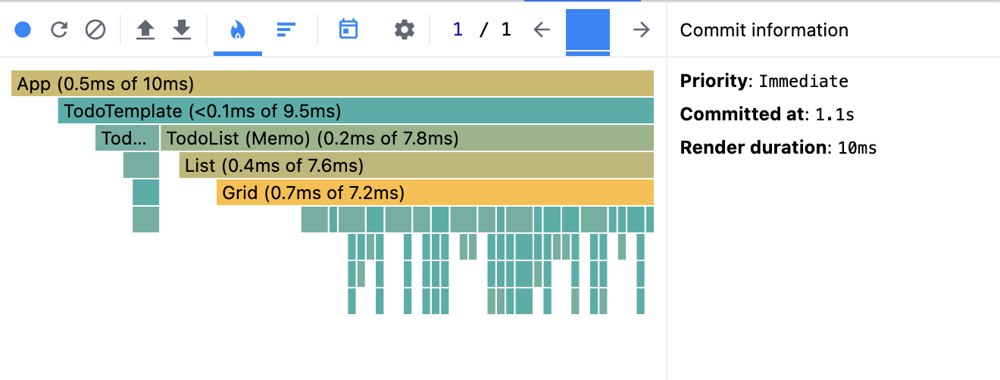
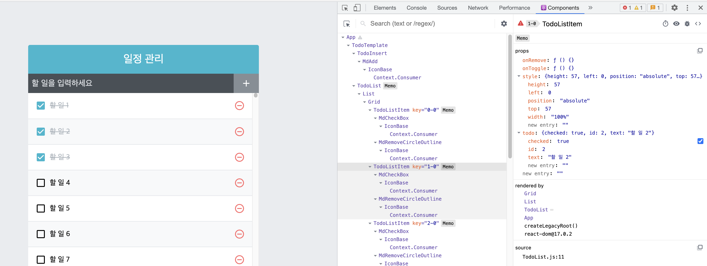

# 개발자 도구를 통한 성능 모니터링

> 출처 [리액트를 다루는 기술](http://www.kyobobook.co.kr/product/detailViewKor.laf?mallGb=KOR&ejkGb=KOR&barcode=9791160508796)을 보고 정리한 내용입니다.

크롬 확장 프로그램 중 [React Developer tools](https://chrome.google.com/webstore/detail/react-developer-tools/fmkadmapgofadopljbjfkapdkoienihi?hl=ko)를 설치하고 개발자 도구를 열면 여러 편리한 기능이 존재한다.

아래 사진 좌측 상단에서 파란 동그라미를 누른 후 어떤 행위를 한 뒤 다시 누르면 해당 행위를 한 동안 리렌더링에 걸린 시간, 리렌더링된 컴포넌트 등의 정보를 볼 수 있다.

components 탭에서는 컴포넌트 트리?, props, style 등의 정보 또한 볼 수 있다.

