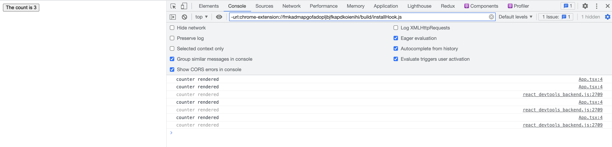
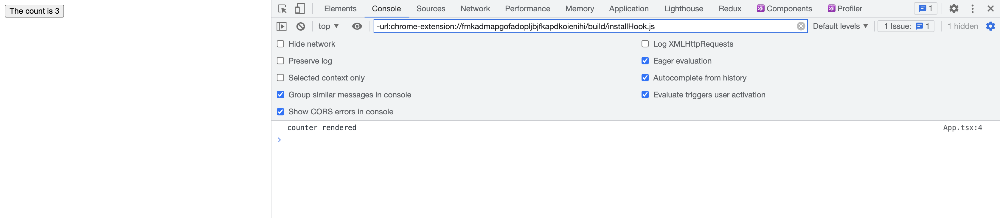

# 렌더링 최적화를 위한 트릭

> 출처 [렌더링 최적화를 위한 트릭](https://kentcdodds.com/blog/optimize-react-re-renders)을 보고 정리한 내용입니다.

#1 Counter 컴포넌트 안에 Logger 컴포넌트를 jsx로 선언

```js
import * as React from "react";
import ReactDOM from "react-dom";

function Logger(props) {
    console.log(`${props.label} rendered`);
    return null;
}

function Counter() {
    const [count, setCount] = React.useState(0);
    const increment = () => setCount((c) => c + 1);

    return (
        <div>
            <button onClick={increment}>The count is {count}</button>
            <Logger label="counter" />
        </div>
    );
}

ReactDOM.render(<Counter />, document.getElementById("root"));
```



#2 Counter 컴포넌트에 Logger 컴포넌트를 props 으로 전달해서 선언

```js
import * as React from "react";
import ReactDOM from "react-dom";

function Logger(props) {
    console.log(`${props.label} rendered`);
    return null; // what is returned here is irrelevant...
}

function Counter(props) {
    const [count, setCount] = React.useState(0);
    const increment = () => setCount((c) => c + 1);
    return (
        <div>
            <button onClick={increment}>The count is {count}</button>
            {props.logger}
        </div>
    );
}

ReactDOM.render(
    <Counter logger={<Logger label="counter" />} />,
    document.getElementById("root")
);
```



각각 버튼을 눌렀을 때 #2번 코드만 Logger 컴포넌트가 리렌더링을 하여 콘솔이 찍히고 있다.

부모 컴포넌트인 카운터 컴포넌트의 count state가 변경될 때마다 자식 컴포넌트가 리렌더링되는줄 알았지만 결과를 보면 달랐다.

왜 이런 차이가 생기는지 알아보기에 앞서 필요한 선수지식을 얻기 위해 [jsx](/React/jsx.md) 혹은 [공식문서](https://ko.reactjs.org/docs/introducing-jsx.html)에서 jsx에 대해서 읽어보고 오기를 권한다.

---

#1에서는 **함수 Logger** 가 **함수 Counter**의 return 문 안에 포함되어 있다.

따라서 Counter 컴포넌트가 리렌더링할 때 Logger 컴포넌트는 아래의 과정을 통해 화면에 그려진다.

1. Babel은 JSX (Logger 컴포넌트)를 React.createElement 호출로 컴파일
2. React.createElement 함수는 Counter 컴포넌트에 대한 정보를 가진, 매번 값은 같지만 서로 다른 객체를 반환
3. Counter 컴포넌트의 자식 요소들에 대해서도 재귀적으로 React.createElement가 호출된다.

<span style='color:red'> 정리하자면 매번 컴포넌트에 대한 정보를 가진 객체를 반환한다는 것이다.</span>

아래 간략한 React.createElement 함수가 반환하는 객체의 예시이다.

리렌더링시 변경되는 요소에만 "new" 주석을 추가했다.

```js
const counterElement = {
    type: "div",
    props: {
        children: [
            {
                type: "button",
                props: {
                    onClick: increment,
                    children: "The count is 1",
                },
            },
            {
                type: Logger,
                props: {
                    label: "counter",
                },
            },
        ],
    },
};
```

react는 props가 변화했는지를 통해 리렌더링할지 결정한다.

javascript에서 객체는 값이 같더라도 서로 다르다. 그렇기 때문에 Logger 컴포넌트의 정보를 가진 children 배열의 두 번째 객체가 항상 같은 값이더라도 새로운 객체이기 때문에 리렌더링이 이루어지는 것이다.

```js
const x = { name: "react" };
const y = { name: "react" };

console.log(x === y); // false
```

그렇다면 해당 객체가 매번 다시 만들어지지 않도록 한다면 불필요한 리렌더링을 방지할 수 있다.

해결방안은 #2 코드에서처럼 Logger 컴포넌트를 Counter 컴포넌트의 prop으로 전달하는 것이다.

아래 코드에서 Logger 컴포넌트는 최초에 JSX.element를 만들어 사용하고 매번 재사용하게 된다.

```js
function Counter(props) {
    const [count, setCount] = React.useState(0);
    const increment = () => setCount((c) => c + 1);
    return (
        <div>
            <button onClick={increment}>The count is {count}</button>
            {props.logger}
        </div>
    );
}
```

### 결론

렌더링을 최적화하는 하나의 트릭으로 아래의 방식을 사용할 수 있다.

1. 비용이 비싼 컴포넌트를 자주 렌더링되지 않는 상위 컴포넌트로 올린다.

2. 비용이 비싼 컴포넌트를 prop으로 자식 컴포넌트에 넘긴다.

그렇다면 렌더링 최적화를 위해 모든 프로젝트 코드 베이스에 React.memo를 사용할 필요 없이 성능 문제를 해결할 수 있다.
