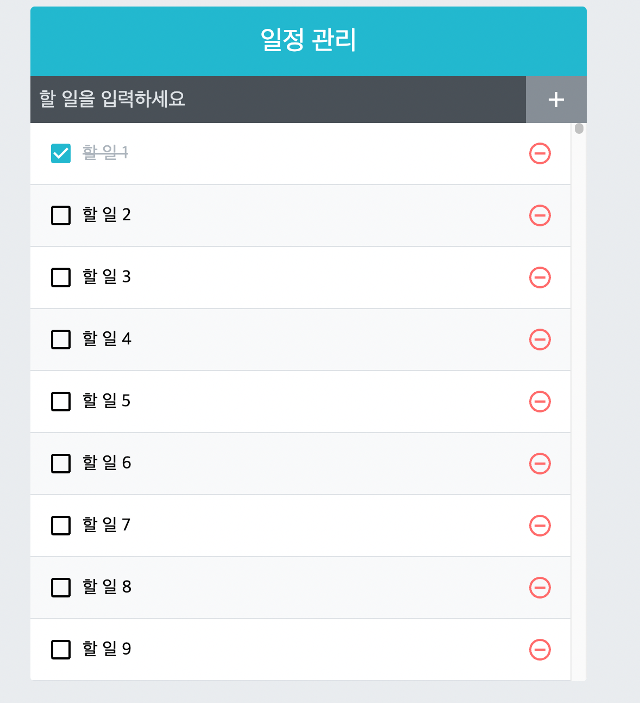

# 컴포넌트 성능 최적화

> 출처 [리액트를 다루는 기술](http://www.kyobobook.co.kr/product/detailViewKor.laf?mallGb=KOR&ejkGb=KOR&barcode=9791160508796)을 보고 정리한 내용입니다.

### useCallback

```js
// 3개의 방의 스위치를 제어하는 SmartHome 컴포넌트
import React, { useState, useCallback } from "react";

function SmartHome() {
    const [masterOn, setMasterOn] = useState(false);
    const [kitchenOn, setKitchenOn] = useState(false);
    const [bathOn, setBathOn] = useState(false);

    const toggleMaster = () => setMasterOn(!masterOn);
    const toggleKitchen = () => setKitchenOn(!kitchenOn);
    const toggleBath = () => setBathOn(!bathOn);

    return (
        <>
            <Light room="침실" on={masterOn} toggle={toggleMaster} />
            <Light room="주방" on={kitchenOn} toggle={toggleKitchen} />
            <Light room="욕실" on={bathOn} toggle={toggleBath} />
        </>
    );
}

// 각각의 방 컴포넌트
import React from "react";

function Light({ room, on, toggle }) {
    console.log({ room, on });
    return (
        <button onClick={toggle}>
            {room} {on ? "💡" : "⬛"}
        </button>
    );
}
```

위 코드에서 침실의 불을 키면 다른 컴포넌트인 주방,욕실 또한 리렌더링된다. 이는 SmartHome 컴포넌트가 리렌더링되면서 toggleMaster,toggleKitchen,toggleBath 함수 모두 다시 선언하기 때문에 이를 props로 하는 컴포넌트들 또한 리렌더링이 된다.

이러한 불필요한 호출을 막기 위해 리렌더링이 잦은 컴포넌트 안에서 선언된 함수 혹은 props로 전달되는 함수는 useCallback으로 감싸 최적화를 해줘야 한다.

---



todo앱을 캡처한 위 사진은 할 일이 2500개이다.

하나의 할 일 컴포넌트를 완료할 때마다 모든 할 일 컴포넌트가 그럴 필요가 없음에도 리렌더링되고 있는데 이럴 때 사용하는 것이 React.memo이다.

### React.memo

함수 컴포넌트에서 컴포넌트의 props가 바뀌지 않았다면 리렌더링하지 않도록 설정하여 함수 컴포넌트의 리렌더링 성능을 최적화할 수 있다.

사용법은 간단하다. 원하는 컴포넌트를 React.memo의 인자로 넘기면 된다.

```js
// ex
export default React.memo(TodoListItem);
```

성능적으로 이점을 얻지 못하면 사용하지 않는 편이 좋다.

리렌더링할 때 props가 자주 변하지 않는 컴포넌트를 렌더링하더라도 다음의 작업을 한다.

-   이전 props와 다음 props의 동등 비교를 위해 비교 함수를 수행한다.
    따라서 현명하게 사용할 필요가 있다.

---

### 함수형 업데이트

리액트에서 setState를 사용하여 상태를 업데이트할 경우, 업데이트된 상태는 즉시 반영되지 않는다.setState는 비동기적으로 작동하기 때문이다.

이는 여러 개의 state를 다룰 때 퍼포먼스 측면에서 유리하다.

여러 state를 동시에 업데이트하는 경우 리액트는 state를 batching(여러 개의 state 업데이트를 하나의 리렌더링 (re-render)로 묶는 것을 의미한다.)하여 업데이트를 진행한다.

```js
export default function App() {
    const [value, setValue] = useState(0);

    const onClick = () => {
        setValue(value + 1);
        setValue(value + 1);
        setValue(value + 1);
    };

    return (
        <div className="App">
            <button onClick={onClick}>+</button>
            <h1>{value}</h1>
        </div>
    );
}
```

위 코드에서 onClick 이벤트 결과를 보면 value는 1만 증가한다. batching에 의해 동기적으로 작동하지 않고 아래의 매커니즘으로 렌더링 단위로 값이 변경한다.

```js
// A : 이번 렌더링의 초기(시작) state 값
// B : 저장하여 다음 렌더링에 사용될 state 값

// A = 0

setValue(value + 1);
// ① B = A + 1 => 2

setValue(value + 1);
// ② B = A + 1 => 2

setValue(value + 1);
// ③ B = A + 1 => 2
```

setState를 동기적으로 사용하기 위해선 함수형 업데이트를 사용하여 업데이트된 값을 저장해 여러 번의 업데이트를 적용시킨다.

```js
// A : 이번 렌더링 초기(시작) state 값
// B : A 또는 이번 렌더링에서 업데이트된 값 / 다음 렌더링에 사용될 값
// C : 함수형 업데이트를 통해 생겨난 값
// A = 0
// B = A = 0

setValue((prev) => prev + 1);
// ①-1 : C = B + 1 => 1
// ①-2 : C 를 B 에 저장

setValue((prev) => prev + 1);
// ②-1 : C = B + 1 => 2
// ②-2 : C 를 B 에 저장

setValue((prev) => prev + 1);
// ③-1 : C = B + 1 => 3
// ③-2 : C 를 B 에 저장
```

함수형 업데이트는 setState를 비동기적으로 사용할 때 말고 최적화를 위한 상황에도 사용된다.

아래 코드 todos 변수는 할 일을 담는 용도로 useState 변수로 선언되었다.

useCallback으로 선언했지만 todos 자체는 상태가 변경 가능하기 때문에 이는 별 효과가 없다.

따라서 값을 전달하기 보다 함수를 전달해서 useCallback과 함께 사용해야 올바른 최적화이다.

```js
const [todos, setTodos] = useState([
    {
        id: 1,
        text: "리액트의 기초 알아보기",
        checked: true,
    },
    {
        id: 2,
        text: "컴포넌트 스타일링해 보기",
        checked: true,
    },
    {
        id: 3,
        text: "일정 관리 앱 만들어 보기",
        checked: false,
    },
]);

const onRemove = useCallback((id) => {
    setTodos(todos.filter((todo) => todo.id !== id)); // x
    setTodos((todos) => todos.filter((todo) => todo.id !== id)); // o
}, []);
```

---

### react-virtualized

위에서 보인 일정 관리 앱은 화면 상에는 9개만 보이지만 하단에 스크롤하면 나오는 컴포넌트들은 불필요하게 미리 렌더링이 이루어진다.

react-virtualized는 스크롤되기 전에 보이지 않는 컴포넌트는 렌더링하지 않고 크기만 차지하도록 해 낭비되는 자원을 아낄 수 있다.

```js
import { List } from "react-virtualized";

const TodoList = ({ todos, onRemove, onToggle }) => {
    const rowRenderer = useCallback(
        ({ index, key, style }) => {
            const todo = todos[index];
            return (
                <TodoListItem
                    todo={todo}
                    key={key}
                    onRemove={onRemove}
                    onToggle={onToggle}
                    style={style}
                />
            );
        },
        [onRemove, onToggle, todos]
    );
    return (
        <List
            className="TodoList"
            width={512} // 전체 크기
            height={513} // 전체 높이
            rowCount={todos.length} // 항목 개수
            rowHeight={57} // 항목 높이
            rowRenderer={rowRenderer} // 항목을 렌더링할 때 쓰는 함수
            list={todos} // 배열
            style={{ outline: "none" }} // List에 기본 적용되는 outline 스타일 제거
        />
    );
};
```

사용법은 간단하다. react-virtualized 설치 후 List 컴포넌트를 이용하여 전체 크기, 항목 높이 등의 속성을 입력하고 rowRenderer함수를 선언하면 된다.
