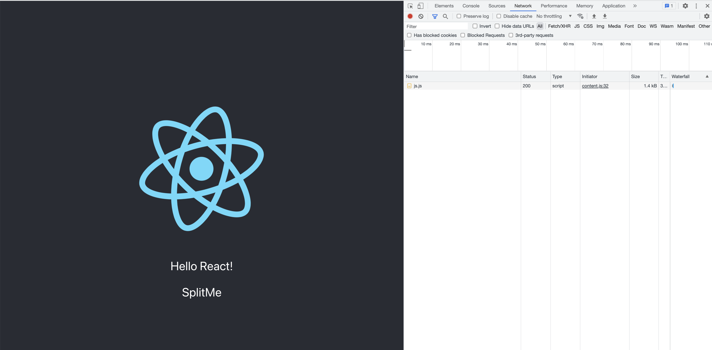

# 코드 스플리팅

> 출처 [리액트를 다루는 기술](http://www.kyobobook.co.kr/product/detailViewKor.laf?mallGb=KOR&ejkGb=KOR&barcode=9791160508796)을 보고 정리한 내용입니다.

완성된 프로젝트를 배포하기 전에는 빌드 작업을 거쳐야 한다. 빌드 작업을 통해서 불필요한 주석, 경고 메시지, 공백 등을 제거해 파일 크기를 최소화한다. 브라우저에서 JSX 문법이나 최신 자바스크립트 문법이 우너할히 실행되도록 트랜스파일 작업이 실행되기도 한다.

이 작업은 웹팩(webpack)이란 도구가 담당하는데 별도 설정을 하지 않으면 모든 자바스크립트 파일이 합쳐진다.

그렇게 되면 페이지 A를 사용하기 위해서 불필요한 페이지 B, 페이지 C에 대한 코드가 한 파일에 저장되어 파일의 크기도 커지고 로딩이 오래 걸려 사용자 경험이 안 좋아지고 트래픽도 많이 나온다.

이러한 문제점을 해결하기 위해 코드 스플리팅을 한다.

## 자바스크립트 함수 비동기 로딩

```js
export default function notify() {
    alert("안녕하세요!");
}
```

```js
import notify from "./notify";

function App() {
    const onClick = () => {
        notify();
    };

    return <div onClick={onClick}>activate notify</div>;
}
```

위의 코드는 activate notify 를 클릭하면 import한 notify 함수가 실행된다. 이 코드를 작성하고 빌드하면 notify 코드가 main 파일 안에서 합쳐진다.

아래는 dynamic import 라는 문법을 통해서 동적으로 모듈을 불러오는 방식이다.

```js
function App() {
    const onClick = () => {
        import("./notify").then((result) => result.default());
    };

    return <div onClick={onClick}>activate notify</div>;
}
```

이를 빌드하면 notify 코드가 App 코드와 분리되어 빌드된다.

## React.lazy와 Suspense를 통한 컴포넌트 코드 스플리팅

아래 코드는 React.lazy와 Suspense를 활용하여 코드 스플리팅한 예시이다.

React.lazy는 컴포넌트를 렌더링하는 시점에서 비동기적으로 로딩할 수 있게 해 주는 유틸 함수이다.

Suspense는 리액트 내장 컴포넌트로 코드 스플리팅된 컴포넌트를 로딩하도록 발동시킬 수 있고, 로딩이 끝나지 않았을 때 보여 줄 UI를 fallback props를 통해 설정할 수 있다.

```js
import React from "react";

const SplitMe = () => {
    return <div>SplitMe</div>;
};

export default SplitMe;
```

```js
import { useState, Suspense } from "react";

const SplitMe = React.lazy(() => import("./SplitMe"));

function App() {
    const [visible, setVisible] = useState(false);
    const onClick = () => {
        setVisible(true);
    };

    return (
        <Suspense fallback={<div>loading...</div>}>
            {visible && <SplitMe />}
        </Suspense>
    );
}
```



위 사진은 Hello React!를 클릭하여 SplitMe 파일을 동적으로 서버에 요청하여 응답받은 결과를 보여준다.
