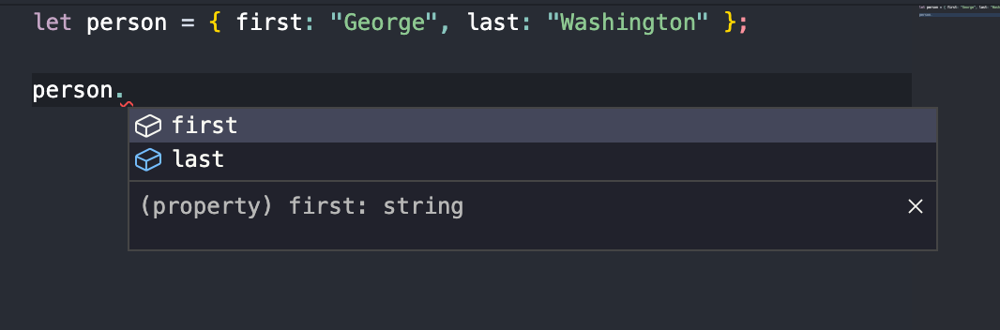
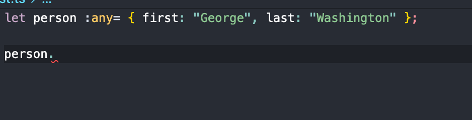

# any 타입 지양하기

> 출처 [이펙티브 타입스크립트](http://www.kyobobook.co.kr/product/detailViewKor.laf?mallGb=KOR&ejkGb=KOR&barcode=9788966263134)를 보고 정리한 내용입니다.

### any 타입에는 타입 안정성이 없다.

```ts
let age: number;
age = "12"; //Type 'string' is not assignable to type 'number'.ts(2322)
age = "12" as any;

age += 1; // 런타임에 정상 age = 121
```

위 예제에서 "12"는 string 타입으로 age에 할당할 수 없지만 as any를 사용하면 string 타입에 할당할 수 있게 된다.

---

### any는 함수 시그니처를 무시한다.

함수를 작성할 때는 시그니처를 명시해야 한다.

호출하는 쪽은 약속된 타입의 입력을 제공하고, 함수는 약속된 타입의 출력을 반환한다.

아래 birthDate 매개변수는 string이 아닌 Date 타입이어야 한다. any 타입을 사용하면 calculateAge의 시그니처를 무시하게 된다.

```ts
function calculateAge(birthDate:Date) number{

}

let birthDate : any = '1990-01-19`;

calculateAge(birthDate); // 정상
```

---

### any타입에는 언어 서비스가 적용되지 않는다.

타입이 있다면 타입스크립트 언어 서비스는 자동완성 기능과 적절한 도움말을 제공한다.



그러나 any타입인 심벌을 사용하면 도움을 받지 못한다.



---

### any는 타입 설계를 감춘다.

애플리케이션 상태 같은 객체를 정의하려면 상태 객체 안에 있는 수많은 속성의 타입을 일일이 작성해야 한다.

이럴 때 any를 사용하면 간단히 끝내버릴 수 있는데, 그렇게 되면 타입 설계가 불분명해진다.

설계가 잘 되었는지, 어떻게 되었는지 전혀 알 수 없기 때문에 타입을 일일이 작성해야 한다.

---

### any는 타입시스템의 신뢰도를 떨어트린다.

보통 타입 체커가 실수를 잡아주고 코드의 신뢰도가 올라간다. 그러나 런타임에 타입 오류를 발견하게 되고 이게 any에서 비롯된 상황임을 알게 되면 any의 편의성보단 불편함을 느낄 것이다.
