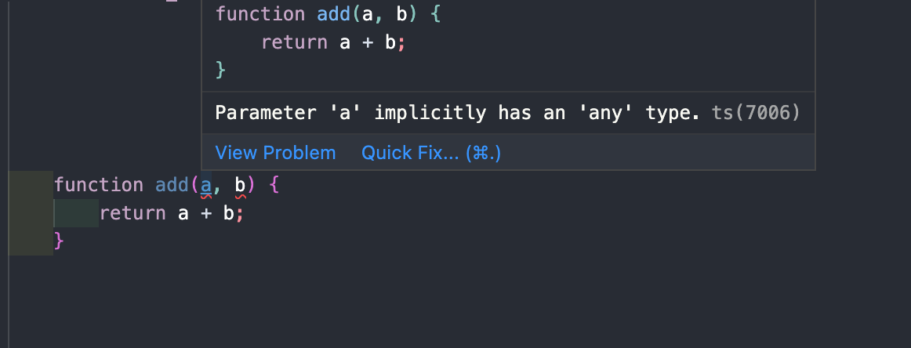

# tsconfig

> 출처 [이펙티브 타입스크립트](http://www.kyobobook.co.kr/product/detailViewKor.laf?mallGb=KOR&ejkGb=KOR&barcode=9788966263134)를 보고 정리한 내용입니다.

```js
function add(a, b) {
    return a + b;
}
```

위 함수가 타입스크립트의 타입 체커를 통과할지 여부는 타입스크립트 컴파일러의 설정을 알아야 대답할 수 있다.

### - noImplicitAny

타입스크립트는 타입 정보를 가질 때 가장 효과적이기 때문에 noImplicityAny 설정을 필수적으로 사용해야 한다.

이는 any 타입의 사용을 막는다.



### - strictNullChecks

strictNullChecks는 null이나 undefined가 모든 타입에서 허용되는지 확인하는 설정이다.

```js
// strictNullChecks가 해제된 경우
const x: number = null; // 정상. 유효한 값

// strictNullChecks가 설정된 경우
const x: number = null; //error, null 형식은 number에 할당할 수 없습니다.

// null 을 허용하고 싶다면 명시적으로 드러내야 한다.
const x: number | null = null;
```

### - noEmitOnError

타입스크립트 컴파일러는 1. 코드를 브라우저에서 동작 가능한 구번전의 js 코드로 트랜스파일하기 2. 코드의 타입 오류를 체크 2가지 역할을 한다.

이때 둘은 독립적으로 동작하기 때문에 코드에 타입 오류가 있어도 컴파일은 가능하다.

만약 타입 오류가 있는 경우 컴파일 되지 않도록 할때 noEmitOnError 설정을 사용한다.
