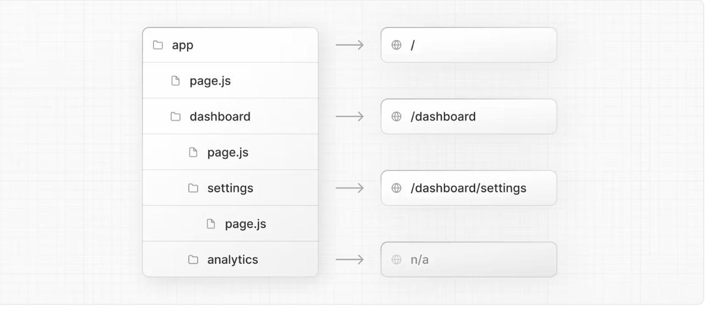

# routing

> 출처 [NextJS 공식문서](https://nextjs.org/)를 보고 정리한 내용입니다.

NextJS의 주요한 변화는 라우팅 방식이 기존 page router에서 App router가 추가된 점이다.

### Nested Routes

기본적으로 파일 구조를 URL path가 따라가는 것은 동일하다.

### File Conventions

단, layout, page, loading, not-found... 일부 파일명은 특정한 용도로 프로젝트 내에서 사용된다. [예를 들어 layout은 세그먼트 및 해당 하위 항목에 대한 공유 UI를 의미한다.](https://nextjs.org/docs/app/building-your-application/routing#file-conventions:~:text=Next.js%20provides%20a%20set%20of%20special%20files%20to%20create%20UI%20with%20specific%20behavior%20in%20nested%20routes) 따라서 이 항목들을 제외한 이름으로 폴더명을 선택해야 한다.

### Component Hierarchy

새롭게 컴포넌트 계층이란 개념도 추가되었다.

페이지에 해당하는 폴더 안에서 layout, template, error, loading, not-found, page라는 이름으로 존재하는 파일들은 아래 사진과 같은 구조로 나열된다. 물론 page.js 파일에서 모두 import하여 사용할 수 있지만 가독성과 관심사를 분리하는 측면에서 아주 좋은 변화라고 생각된다.

### Colocation

그리고 특정 페이지에서만 사용되는 컴포넌트를 page 폴더 내에 보관할 수도 있다. 해당 파일들은 url path로 접근할 수 없고 오로지 page.js파일만 외부에서 접근할 수 있다. components 폴더에서 모든 컴포넌트 파일들을 관리하거나 page단에서 하나의 컴포넌트를 추가로 만드는 bad practice를 해결할 수 있다.

### Advanced Routing Patterns

- Parallel Routes : 한 view에서 두 개 이상의 페이지를 보여줄 수 있다. 아래 이미지를 보면 직관적으로 이해하기 쉽다. 본인은 atomic design을 기반으로 회사에서 작업하고 있는데 molecule, organism,.. 의 구분에 대한 기준이 명확하게 정해져 있지 않은 상태에서 사용하게 되면 오히려 혼란이 가중되기 쉽다고 생각된다.

- Intercepting Routes : 현재 레이아웃 내 애플리케이션의 다른 부분에서 경로를 로드할 수 있다. 이 라우팅 패러다임은 사용자가 다른 컨텍스트로 전환하지 않고도 경로의 내용을 표시하려는 경우 유용하다. /list 페이지에서 /photo/[id] 페이지를 [soft navigation](https://velog.io/@hyunjoong/Next.js-13-Parallel-Intercepting-Routes-jxn0qt37) 방식인 <Link /> 태그로 이동하는 경우 해당 페이지로 이동하지 않고 개발자가 미리 임의로 설정한 페이지가 보이게 된다. 글로는 이해에 어려움이 있어 공식 문서에 있는 예제 프로젝트 링크를 첨부한다.(https://github.com/vercel-labs/nextgram)
