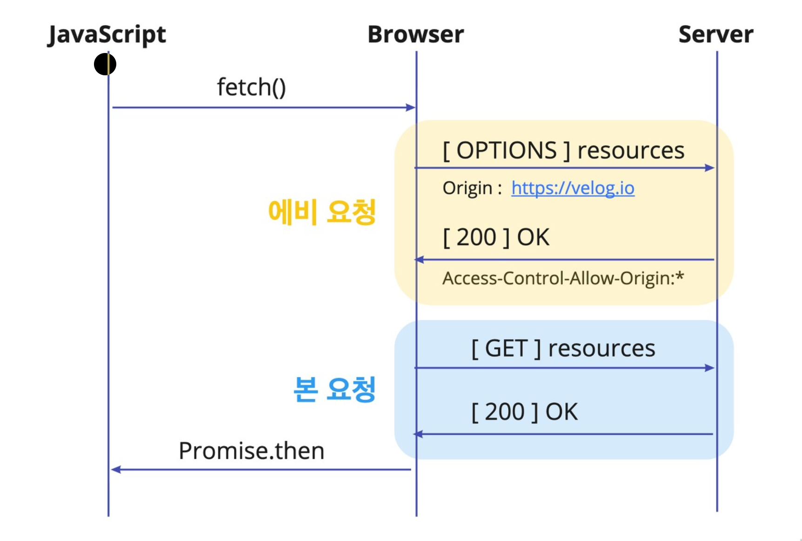
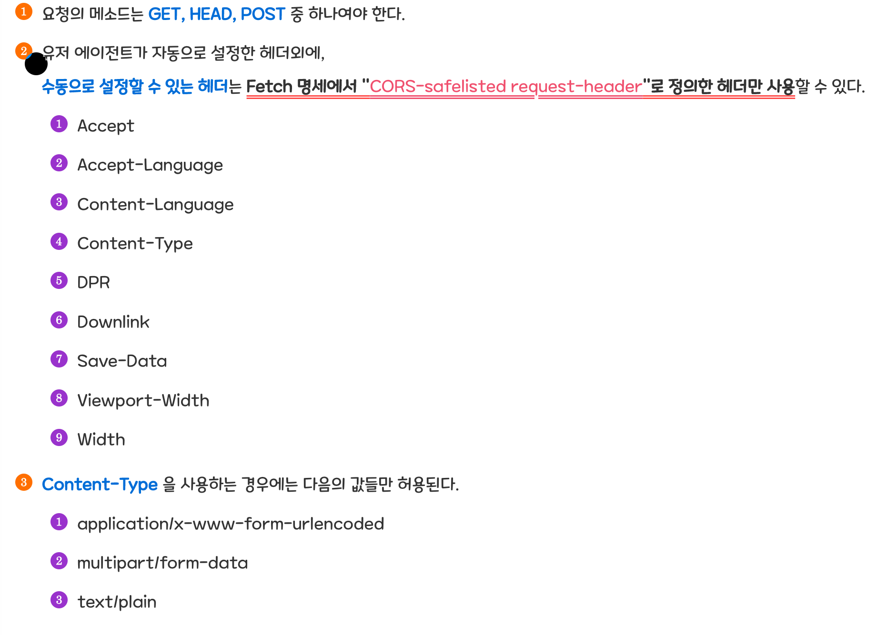
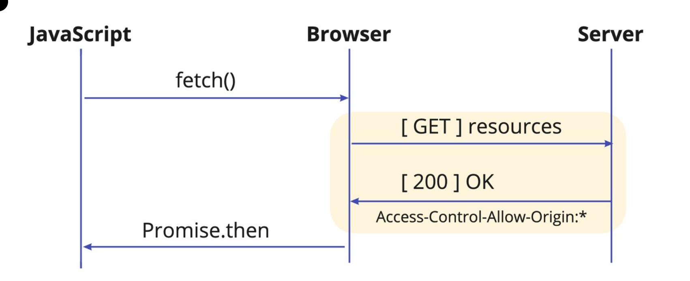

# CORS

CORS(Cross Origin Resource Sharing)은 우리가 가져오는 리소스들이 안전한지 검사하는 관문이다.

이는 HTTP 요청에 대해서 어떤 요청을 하느냐에 따라 다른 특징을 갖기 때문이다.

-   HTML : Cross-Origin 정책을 따름
    -   link 태그에서 다른 origin의 css등의 리소스에 접근 가능
    -   img 태그에서 다른 리소스로 접근 가능
-   XMLHttpRequest, Fetch API 등 script 태그 내 -> 기본적으로 Same Origin 정책을 따름
    -   자바스크립트는 서로 다른 도메인에 대한 요청을 보안상 제한한다.
    -   이 정책을 same origin policy라고 한다.

### 출처(origin)이란?

다른 출처간의 리소스 공유에 대해서 알아보기 전에 출처가 무엇을 의미하는지 이해할 필요가 있다.

서버의 위치를 의미하는 https://google.com 과 같은 URL은 다음과 같이 구성된다.

이때 출처는 protocol과 host port까지 모두 합친 것을 의미한다.

### SOP(same origin policy)

SOP는 '같은 출처에서만 리소스를 공유할 수 있다'라는 규칙을 가진 정책이다.

1. 같은 프로토콜
2. 같은 호스트
3. 같은 포트

를 사용하면 다른 요소(path, query string,fragment)는 다르더라도 같은 출처로 인정된다.

반대로 리소스가 자신의 출처와 다른 경우 브라우저는 교차출처 요청을 실행한다.

출처를 비교하는 로직은 서버에 구현된 스펙이 아닌 브라우저에 구현된 스펙이다.

만약 CORS 정책을 위반하는 요청에 서버가 응답하더라도 바라우저가 응답을 분석해 CORS 정책에 위반되면 응답은 처리하지 않게 된다.

### CORS(Cross origin resource sharing)

교차 출처 리소스 공유는 추가 HTTP 헤더를 사용하여 한 출처에서 실행 중인 웹 에플리케이션이 다른 출처의 자원에 접근할 수 있는 권한을 부여하도록 브라우저에 알려주는 체제이다.

동작과정

1. 클라이언트에서 HTTP 요청의 헤더에 Origin을 담아 전달한다.

-   출처가 다른 origin에 리소스를 요청할 때 클라이언트는 HTTP 요청을 보낸다. 이때 요청헤더의 Origin 필드에 요청을 보내는 Origin을 담아 보낸다.

2. 서버는 응답헤더에 Access-Control-Allow-Origin을 담아 클라이언트로 전달한다.

-   서버는 리소스를 요청할 때 받았던 header에 담긴 origin 을 담아서 클라이언트에 전달한다.

3. 클라이언트는 자신이 보냈던 요청의 origin 과 서버에서 보낸 Access-control-allow-origin을 비교한다.

따라서 서버에서 정상적인 응답을 하여 상태코드 200이 나오더라도, 브라우저가 응답을 CORS 정책 위반이라고 분석하면 해당 응답은 사용하지 못한다.

## cors 시나리오

1. 예비요청(preflight Request)

효율적인 통신을 위해 브라우저는 요청을 한번에 보내지 않고 예비요청과 본요청으로 나누어 서버에 전달한다.

많은 양의 데이터를 서버에 보내기 위해 프론트에서 body에 데이터를 파싱하고 network byte order로 바꾸는 등 여러 과정을 거친 작업을 하기 전에 서버에서 post요청(혹은 그 외)을 허용하는지 확인하기 위해 preflight으로 확인하는 과정을 수행한다.

cross-origin 요청을 하기 전에 OPTIONS 메소드로 preflight를 전송한다. 이때 Response로 Access-Control-Allow-Origin과 Access-Control-Allow-Methods가 넘어오는데 이는 서버에서 어떤 origin과 어떤 method를 허용하는지 브라우저에게 알려주는 역할을 한다.

예비요청은 아래의 조건에 해당되지 않아야만 생략 가능하다.

2. 단순요청

단순요청은 예비요청(preflight)을 보내지 않고 바로 서버에 본 요청을 한 후, 서버가 응답 헤더에 Access-Control-Allow-Origin 값을 보내주면 브라우저가 CORS 정책 위반여부를 검사하는 방식이다.

3. 인증된 요청(credentialed request)

기존 예비요청에서 보안을 강화하는 경우에 사용한다.

기본적인 브라우저가 제공하는 비동기 요청 API인 XMLHttpRequest 객체나 fetch API는 별도의 옵션 없이 브라우저의 쿠키 정보나 인증과 관련된 헤더를 함부로 요청에 담지 않는다.

따라서 요청에 인증과 관련된 정보를 담을 수 있게 해주는 옵션이 credentials 옵션이다.

| 옵션 값            | 설명                                           |
| ------------------ | ---------------------------------------------- |
| same-origin기본값) | 같은 출처 간 요청에만 인증 정보를 담을 수 있다 |
| include            | 모든 요청에 인증 정보를 담을 수 있다           |
| omit               | 모든 요청에 인증 정보를 담지 않는다            |

만약 same-origin,include를 사용해 리소스 요청에 인증 정보가 포함된다면 브라우저는 cors정책 검사 룰에 두 가지를 추가한다.

1. Access-contorol-Allow-Origin에 \* 를 사용할 수 없다.
2. 응답 헤더에는 Access-Control-Allow-Credentials: true 가 존재해야 한다.
