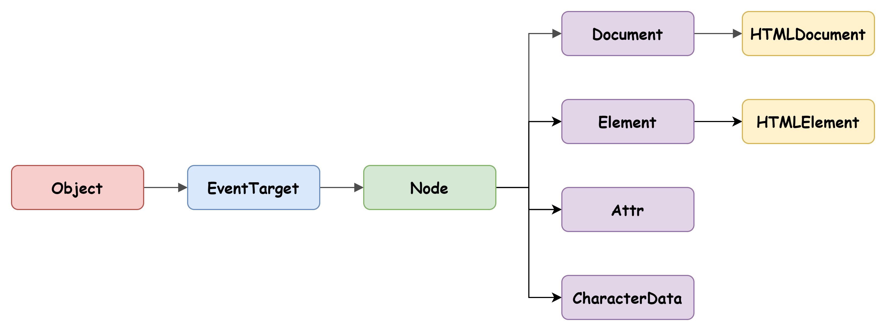

# DOM

> 출처 Modern JavaScript Deep Dive를 보고 정리한 내용입니다.

노드 객체들로 구성된 트리 자료구조를 DOM(document object model)이라고 한다.

DOM은 HTML 문서의 계층적인 구조를 표현하고 이를 제어할 수 있는 API, 즉 프로퍼티와 메서드를 제공하는 트리 자료구조이다.

HTML 문서는 HTML 요소들의 집합으로 이뤄지며, HTML 요소는 중첩 관계를 갖는다. 이러한 HTML 요소 간의 부자 관계를 반영하여 HTML 문서의 구성 요소인 HTML 요소를 객체화한 모든 노드 객체들을 트리 자료 구조로 구성한다.

## 트리 자료 구조

DOM을 구성하는 노드 객체 12개 중 중요한 4가지이다.

-   문서 노드 : DOM 트리의 최상위에 존재하는 루트 노드로서 document 객체를 가리킨다. document객체는 브라우저가 렌더링한 HTML 문서 전체를 가리키는 객체로서 전역 객체 window의 document 프로퍼티에 바인딩되어 있다.

-   요소 노드 : HTML 요소를 가리키는 객체다. 요소 노드는 HTML 요소 간의 중첩에 의해 부자 관계를 가지며 요소 노드로 문서의 구조를 표현한다.

-   어트리뷰트 노드 : 어트리뷰트 노드는 HTML 요소의 어트리뷰트를 가리키는 노드이다. 어트리뷰트 노드는 지정된 요소 노드와 연결된다.

-   텍스트 노드 : HTML 요소의 텍스트를 가리키는 노드이다.

---

## 노드 객체의 상속 구조



DOM을 구성하는 노드 객체는 ECMAScript 사양에 정의된 표준 빌트인 객체가 아닌 브라우저 환경에서 제공하는 호스트 객체다.

이 또한 자바스크립트 객체이므로 프로토타입에 의한 상속 구조를 갖는다.

가령 input 요소를 파싱하여 객체화한 input 요소 노드 객체는 Object, EventTarget, Node, Element, HTMLElement, HTMLInputElement 의 프로토타입에 바인딩되어 있는 프로토타입 객체를 상속받는다.

배열이 배열인 동시에 객체인 것처럼 input 요소 노드 객체도 다음과 같이 다양한 특성을 갖는 객체이며 이러한 특성을 나타내는 기능들을 상속을 통해 제공받는다.

| input 요소 노드 객체의 특성                                | 프로토타입을 제공하는 객체 |
| ---------------------------------------------------------- | -------------------------- |
| 객체                                                       | Object                     |
| 이벤트를 발생시키는 객체                                   | EventTarget                |
| 트리 자료구조의 노드 객체                                  | Node                       |
| 브라우저가 렌더링할 수 있는 웹 문서의 요소를 표현하는 객체 | Element                    |
| 웹 문서의 요소 중에서 HTML 요소를 표현하는 객체            | HTMLElement                |
| HTML 요소 중에서 input 요소를 표현하는 객체                | HTMLInputElement           |

DOM은 HTML 문서의 계층적 구조와 정보를 표현하는 것은 물론 노드 객체의 종류, 즉 노드 타입에 따라 필요한 기능을 프로퍼티와 메서드의 집합인 DOM API(Application Programming Interface)로 제공한다.

이 DOM API를 통해 HTML의 구조나 내용 또는 스타일 등을 동적으로 조작할 수 있다.

### 어트리뷰트

```html
<input id="user" type="text" value="aaabb" />
```

HTML 문서의 구성 요소인 HTML 요소는 여러 개의 어트리뷰트를 가질 수 있다. 위에서 id="user", type="text",value="aaabb" 에 해당한다.

input 요소에서만 사용 가능한 요소 외에도 공통적으로 존재하는 글로벌 어트리뷰트(id,class,style,title,lang,tabindex...)와 이벤트 핸들러 어트리뷰트(onclick,onchange,onfocus,onblur...) 가 있다.

HTML 문서가 파싱될 때 HTML 요소의 어트리뷰트는 어트리뷰트 노드로 변환되어 요소 노드와 연결된다. 이떄 HTML 어트리뷰트당 하나의 어트리뷰트 노드가 생성된다.

이 모든 어트리뷰트 노드는 NameNodeMap 객체에 담겨 요소 노드의 attributes 프로퍼티에 담긴다.

### HTML 어트리뷰트 vs DOM 프로퍼티

요소 노드 객체에는 HTML 어트리뷰트에 대응하는 프로퍼티가 존재한다. 이 DOM 프로퍼티들은 HTML 어트리뷰트 값을 초기값으로 가지고 있다.

```html
<input id="user" type="text" value="aaabb" />
```

위의 태그가 파싱되어 생성된 요소 노드 객체에는 id, type,value 어트리뷰트에 대응하는 id,type,value 프로퍼티가 존재한다. 이 DOM 프로퍼티는 HTML 어트리뷰트의 값을 초기값으로 갖는다. 이는 개발자모드에서 태그를 클릭한 후 properties에서 확인 가능하다.

이처럼 HTML 어트리뷰트는 DOM에서 중복 관리되는 것처럼 보인다.

1. 요소 노드의 attributes 프로퍼티에서 관리하는 어트리뷰트 노드

2. HTML 어트리뷰트에 대응하는 요소 노드의 프로퍼티(DOM 프로퍼티)

정말 중복 관리되는 것은 아니고 각각 역할이 다르다. HTML 어트리뷰트의 역할은 HTML 요소의 초기 상태를 지정하는 것이다. 즉, HTML 어트리뷰트 값은 HTML 요소의 초기 상태를 의미하며 이는 변하지 않는다.

따라서 요소의 요소 노드가 생성되어 첫 렌더링이 끝난 시점까지 어트리뷰트 노드의 어트리뷰트 값(DOM 프로퍼티)과 요소 노드의 프로퍼티에 할당된 값은 HTML 어트리뷰트 값과 동일하다.

만약 input 태그에 값을 입력하면 value가 변하는데 이에 따라 DOM 프로퍼티는 변하게 된다. 이를 DOM 프로퍼티,요소 노드는 상태를 갖고 있다고 한다.

정리하자면 사용자 입력에 의해 변경된 최신 상태를 관리해야 하고

새로고침하는 경우를 위해 초기 상태를 유지해야 한다.

이처럼 요소 노드는 2개의 상태, 즉 초기 상태와 최신 상태를 관리해야 한다. 요소 노드의 초기 상태는 어트리뷰트 노드가 관리하며 요소 노드의 최신 상태는 DOM 프로퍼티가 관리한다.
