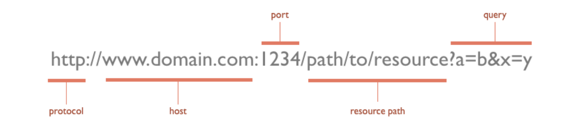

# 브라우저의 렌더링 과정

> 출처 Modern JavaScript Deep Dive를 보고 정리한 내용입니다.

## 렌더링 과정

1. 브라우저의 주소창에 URL을 입력하면 URL의 호스트 이름이 DNS를 통해 IP 주소로 변환되고 이 IP 주소를 갖는 서버에게 요청을 보낸다.

2. 이때 https://www.google.com의 주소를 입력했다고 가정하면 실제로 서버에서는 https://www.google.com/index.html 를 의미하는 html 파일을 클라이언트에 전달한다. (추가로 아래 이미지에서 port, path, query 등의 정보를 서버에서 활용한다.)

3. 서버가 응답한 HTML 문서는 문자열로 이루어진 순수한 텍스트다. 브라우저의 렌더링 엔진은 응답받은 HTML 문서를 파싱하여 브라우저가 이해할 수 있는 자료구조인 DOM(Document Object Model)과 CSSOM을 생성한다. HTML 문서를 한 줄씩 파싱하며 DOM을 생성하다 link 태그(css 파일 로드)나 img 태그, script 태그등을 만나면 DOM 생성을 일시 중단하고 해당 파일을 서버에 요청한다. 이를 결합하여 렌더 트리를 생성한다.

4. 브라우저의 자바스크립트 엔진은 서버로부터 응답된 자바스크립트를 파싱하여 AST(Abstract Syntax Tree)를 생성하고 바이트코드로 변환하여 실행한다. 이때 자바스크립트는 DOM API를 통해 DOM이나 CSSOM을 변경할 수 있다. 변경한 DOM과 CSSOM은 렌더 트리로 결합된다.

5. 렌더 트리를 기반으로 HTML요소의 레이아웃을 계산하고 브라우저 화면에 HTML 요소를 페인팅한다.

---

## HTML 파싱과 DOM 생성

브라우저는 다음과 같은 과정을 통해 응답받은 HTML문서를 파싱하여 DOM을 구성한다.

1. 서버의 HTML 파일을 메모리에 저장한 다음 메모리에 저장된 **바이트**(2진수)를 브라우저 요청에 응답하여 전송한다.

2. 브라우저는 서버가 응답한 HTML 문서를 바이트(2진수) 형태로 응답받는다. 응답된 HTML 문서는 meta 태그의 charset 어트리뷰트에 의해 지정된 인코딩 방식을 기준으로 **문자열**로 변환된다.

3. 문자열로 변환된 HTML 문서를 문법적 의미를 갖는 최소 단위인 **토큰**으로 분해한다.

4. 각 토큰들을 객체로 변환하여 **노드**로 생성한다. 노드는 DOM을 구성하는 기본 요소가 된다.

5. HTML 문서는 HTML 요소들의 집합으로 이루어지며 HTML 요소는 중첩 관계를 갖는다. 이 중첩 관계에 의해 부자 관계가 형성되고 이 부자 관계를 반영하여 모든 노드들을 트리 자료구조로 구성한다. 이 구성된 트리 자료구조를 **DOM**이라 부른다.

DOM으로 변경하는 이유: 웹페이지의 콘텐츠를 javascript를 사용해 동적으로 조작을 하기 위해서 다룰 수 있는 형태의 객체로 변경한다.

---

## CSS 파싱과 CSSOM 생성

렌더링 엔진은 DOM을 생성해 나가다가 CSS를 로드하는 link 태그나 style 태그를 만나면 DOM 생성를 일시 중단하고 link 태그의 href 어트리뷰트에 지정된 CSS 파일을 서버에 요청하여 로드한 CSS 파일이나 style 태그 내의 CSS를 HTML과 동일한 파싱 과정(바이트 -> 문자 -> 토큰 -> 노드 -> CSSOM)을 거쳐 CSSOM을 생성한다.

---

## 렌더 트리 생성

렌더링 엔진은 서버로부터 응답된 HTML 과 CSS로 각각 DOM, CSSOM을 생성한다. DOM과 CSSOM은 서로 독립적인 트리로 구조와 디자인을 담담하며 이를 렌더링을 위해 렌더 트리로 결합된다.

렌더 트리는 화면에 표시되어야 할 모든 노드의 컨텐츠, 스타일 정보를 포함하는 렌더링을 위한 트리 구조의 자료구조다. script,meta 같은 태그에 의한 노드는 포함되지 않고 렌더 트리는 브라우저 화면에 렌더링되는 노드만으로 구성된다.

이후 렌더 트리는 레이아웃 계산과 브라우저 화면에 픽셀을 렌더링하는 페인팅 처리에 입력된다.

다음과 같은 경우에 렌더링 과정이 반복해서 실행될 수 있다.

-   자바스크립트에 의한 노드 추가 및 삭제
-   브라우저 창의 리사이징에 의한 뷰포트 크기 변경
-   HTML 요소의 레이아웃에 변경을 발생시키는 스타일 변경

---

## 자바스크립트 파싱과 실행

렌더링 엔진은 HTML 파일을 파싱할 때 link태그를 만나 CSSOM을 생성할 때처럼 script 태그를 만나면 src속성에 적혀있는 파일을 서버에 요청해 받아온 뒤 마찬가지로 파싱을 한다. 단, 브라우저의 렌더링 엔진이 아닌 javascript 엔진이 담당하게 된다.

---

## 자바스크립트 파싱에 의한 HTML 파싱 중단

브라우저는 동기적으로, 즉 순차적으로 HTML, CSS, JS를 위에서 아래로 파싱하고 실행한다. 따라서 script태그의 위치에 따라 HTML 파싱이 블로킹되어 DOM 생성이 지연될 수 있다.

따라서 다음 2가지의 이유로 script 태그는 body요소 가장 아래에 위치시키는 것이 좋다.

-   DOM이 완성되지 않은 상태에서 자바스크립트가 DOM을 조작하면 에러가 발생한다.
-   자바스크립트 로딩,파싱,실행으로 인해 HTML 요소들의 렌더링이 지장받는 일이 발생하지 않아 페이지 로딩 시간이 단축된다.

경우에 따라서 script 태그에 async, defer속성을 적절하게 사용해야 한다.
([defer,async 스크립트 작성글](/브라우저/defer,async스크립트.md))

---

## 레이아웃

이전에 만들었던 렌더트리에 있는 요소의 위치와 크기에 관련된 정보를 바탕으로 화면에 어디에, 어떤 크기로 배치할지 파악하는 과정이다.

## 페인팅

렌더 트리를 순회하며 페인트 함수를 호출해 노드를 화면에 표현한다.

## 리플로우

생성된 DOM 노드의 레이아웃 변경 시 영향을 받는 모든 노드의 수치를 다시 계산해 **레이아웃 트리를 재생성**하는 작업이다. (width, height, padding, margin, float, position 등의 속성이 영향을 준다.)

## 리페인트

리플로우 과정이 끝나고 재생성된 렌더 트리를 다시 그리는 작업이다.(color, border-radius, background, box-shadow 등등 레이아웃에 영향을 주진 않지만 시각적인 요소가 바뀌는 속성이 영향을 준다.)

-   추가로 리플로우, 리페인트의 과정이 많을수록 렌더링 성능이 저하가 되기 때문에 이에 대한 최적화가 필요하다.
    -   requestAnimationFrame : 브라우저에 수행하려는 애니메이션을 알려 다음 리페인트가 진행되기 전에 애니메이션을 업데이트하는 함수롤 호출한다. 디스플레이의 주사율에 맞춰 애니메이션이 진행된다. [requestAnimationnFrame 정리되어 있는 블로그 게시물입니다.](https://velog.io/@0715yk/HTML-requestAnimationFrame)
    -   혹은 top, left를 이용하지 않고 transform을 이용하면 cpu가 아닌 gpu로 화면 렌더링을 처리한다.
