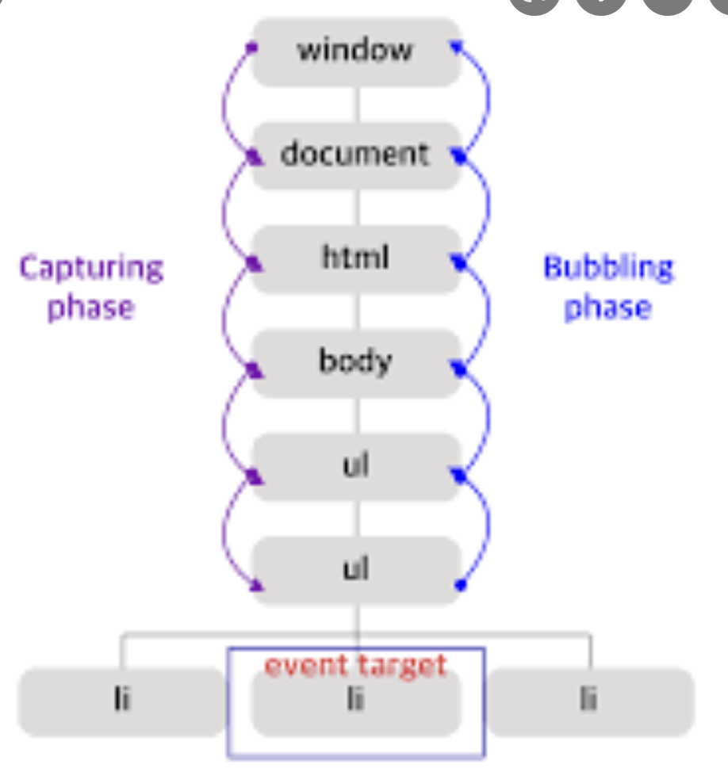

# 이벤트

> 출처 Modern JavaScript Deep Dive를 보고 정리한 내용입니다.

브라우저는 처리해야 할 특정 사건이 발생하면 이를 감지해 이벤트를 발생시킨다.

특정 이벤트에 대해 반응해 호출될 함수를 이벤트 핸들러, 이벤트가 발생했을 때 브라우저에게 이벤트 핸들러의 호출을 위임하는 것을 이벤트 핸들러 등록이라 한다.

### 이벤트 객체

이벤트가 발생하면 이벤트에 관련한 다양한 정보를 담고 있는 이벤트 객체가 동적으로 생성되고 이벤트 핸들러의 첫 번째 인수로 전달된다.

<image src="image/이벤트/이벤트상속구조.png" width="400" height="200">

이처럼 이벤트가 발생하면 암묵적으로 생성되는 이벤트 객체도 생성자 함수에 의해 생성된다. 그리고 생성된 이벤트 객체는 생성자 함수와 더불어 생성되는 프로토타입으로 구성된 프로토타입 체인의 일원이 된다.

### 이벤트 객체의 공통 프로퍼티

프로토타입 체인에 속하는 이벤트 객체에는 공통으로 Event 인터페에스, Event.prototyp에 정의되어 있는 이벤트 관련 프로퍼티를 상속받는다.

| 공통 프로퍼티 | 설명                              | 타입          |
| ------------- | --------------------------------- | ------------- |
| type          | 이벤트 타입                       | string        |
| target        | 이벤트를 발생시킨 DOM 요소        | DOM 요소 노드 |
| currentTarget | 이벤트 핸들러가 바인딩된 DOM 요소 | DOM 요소 노드 |

등등

이벤트 객체의 target 프로퍼티는 이벤트를 발생시킨 객체이다.

이벤트 객체의 currentTarget 프로퍼티는 이벤트 핸들러가 바인딩된 DOM 요소를 가리킨다.

일반적으로 이벤트 객체의 target 프로퍼티와 currentTarget 프로퍼티는 동일한 DOM 요소를 가리키지만 이벤트 위임에서는 서로 다른 DOM 요소를 가리킨다.

### 이벤트 전파

DOM 트리 상에 존재하는 DOM 요소 노드에서 발생한 이벤트는 DOM 트리를 통해 전파된다. 이를 이벤트 전파라고 한다.

````html
```<!DOCTYPE html>
<html lang="en">
    <head> </head>
    <body>
        <ul>
            <li></li>
            <li></li>
            <li></li>
        </ul>
    </body>
</html>
````

위 ul 요소의 자식 요소인 li 요소를 클릭하면 클릭 이벤트가 발생한다. 이때 생성된 이벤트 객체는 이벤트를 발생시킨 DOM 요소를 이벤트 타깃을 중심으로 DOM 트리를 통해 전파된다.



상단 그림에서 li 요소를 클릭하여 발생한 이벤트 객체의 event.target은 li 요소이고 event.currentTarget은 ul 요소이다.

li 요소를 클릭하면 클릭 이벤트가 발생해 클릭 이벤트 객체가 생성되고 클릭된 li 요소가 이벤트 타깃이 된다. 이때 클릭 이벤트 객체는 window에서 시작해서 이벤트 타깃 방향으로 전파한다.**(위에서 아래로 전파한다!)** 이것이 캡처링 단계다.

이후 이베트 객체는 이벤트를 발생시킨 이벤트 타깃에서 시작해서 window 방향으로 전파된다. 이것이 버블링 단계다.

이벤트 전파는 이벤트 객체가 전파되는 방향에 따라 다음과 같이 3단계로 구분할 수 있다.

-   캡처링 단계 : 이벤트가 상위 요소에서 하위 요소 방향으로 전파

-   타깃 단계 : 이벤트가 이벤트 타깃에 전달

-   버블링 단계 : 이벤트가 하위 요소에서 상위 요소 방향으로 전파

이처럼 이벤트는 이벤트를 발생시킨 이벤트 타깃은 물론 상위 DOM 요소에서도 캐치할 수 있다.

즉, DOM 트리를 통해 전파되는 이벤트는 이벤트 패스(이벤트가 통과되는 DOM 트리 상의 경로)에 위치한 모든 DOM 요소에서 캐치할 수 있다.

## 이벤트 위임

위 그림에서 li 요소가 가령 100개이고 각각에 이벤트 핸들러를 등록하면 성능 저하의 원인이 되고 유지 보수에도 부적합한 코드를 생성한다.

이벤트 위임은 여러 개의 하위 DOM 요소에 각각 이벤트 핸들러를 등록하는 대신 하나의 상위 DOM 요소에 이벤트 핸들러를 등록하는 방법이다.

단, 주의해야 하는 점은 상위 요소에 이벤트 핸들러를 등록하기 때문에 이벤트 타깃, 즉 이벤트를 실제로 발생시킨 DOM 요소가 개발자가 기대한 DOM 요소가 아닐 수도 있다.

따라서 이벤트 위임을 통해 상위 요소에 이벤트 핸들러를 등록한 경우 이벤트 객체의 target 프로퍼티와 currentTarget프로퍼티가 다르다.

위 상황에는 target 프로퍼티는 li 요소, currentTarget 프로퍼티는 ul 요소이다.

## 이벤트 전파 방지

stopPropagation 메서드는 이벤트 전파를 중지시킨다. 하위 li 요소를 클릭했을 때 상위 ul 요소로 이벤트가 전파되지 않게 하는 등,
하위 DOM 요소의 이벤트를 개별적으로 처리하기 위해 이벤트의 전파를 중단시킨다.

사실 언제 사용이 필요한 경우가 생길지 모르겠다.
