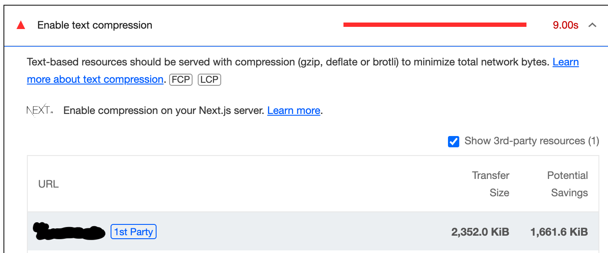
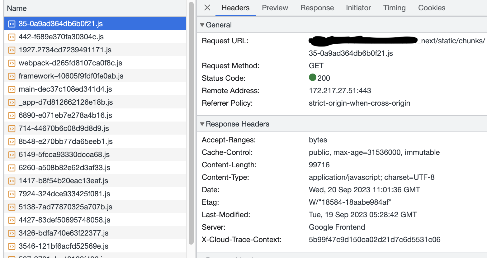
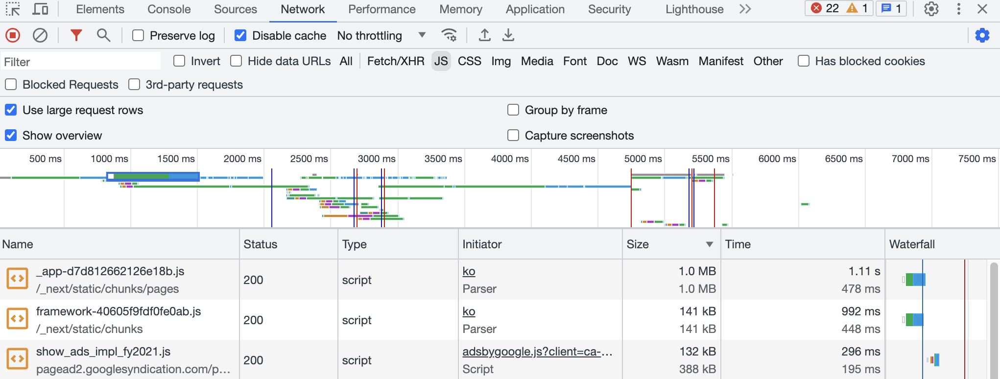

# Text Compression

(\*회사에서 웹 성능 개선 작업을 하며 학습한 내용입니다.)

목표: 렌더링된 콘텐츠와 정적 파일을 압축하기 위해 Next.js가 제공하는 gzip 압축을 사용

next.config.js에 해당 옵션을 추가합니다.

```js
module.exports = {
  compress: false,
};
```

적용 전.

Transfer Size: 2352KB



적용 후.

적용 후에도 lighthouse에서는 변화 없이 텍스트 기반 리소스를 압축하라고 제안합니다. [NextJS V.9.0.7 릴리즈 노트](https://nextjs.org/blog/next-9-0-7#gzip-compression-by-default:~:text=for%20Windows%20users.-,Gzip%20Compression%20by%20Default,-While%20investigating%20why) 를 확인해보니 nextjs는 9버전부터 gzip압축을 디폴트로 제공하고 있습니다.

lighthouse는 network response header에 content-encoding이 존재하지 않는 경우 압축된 request로 분류하지 않았습니다. [text compression 구글 문서](https://developer.chrome.com/docs/lighthouse/performance/uses-text-compression/#:~:text=%23-,Check%20if%20a%20response%20was%20compressed%20in%20Chrome%20DevTools,-To%20check%20if)



Size 열에 존재하는 첫 번째 1.0MB는 압축된 후 크기, 두 번째는 1.0MB는 압축 전 크기입니다.

nextjs 서버에서 온 response들은 모두 사이즈가 동일합니다.



[압축되었는지 확인하는 방법](https://developer.chrome.com/docs/lighthouse/performance/uses-text-compression/#:~:text=%23-,Check%20if%20a%20response%20was%20compressed%20in%20Chrome%20DevTools,-To%20check%20if)

custom HTTP headers를 명시할 수 있지만 성능 상에 이점이 있는 작업은 아니기에 완료 처리하겠습니다.
[custom header 설정하는 방법](https://github.com/vercel/next.js/discussions/48827)

결과 : 이미 압축은 사용되고 있었고 response header에 content-encoding 항목이 존재하지 않아 lighthouse에서 체크되지 않아 개선 항목으로 제시되었습니다.

(gzip보다 20% 가량 압축 효율이 좋은 brotli 압축 알고리즘을 적용해보려 했지만 nextJS에서 적용한 자료를 찾을 수 없었습니다.)[gzip vs brotli](https://www.siteground.com/blog/brotli-vs-gzip-compression/#What_is_Brotli_Compression:~:text=web%20content.-,What%E2%80%99s%20The%20Difference%20Between%20Brotli%20and%20Gzip%20Compression%3F,-While%20they%20both)

관련 자료

- https://nextjs.org/docs/app/api-reference/next-config-js/compress
- https://developer.chrome.com/docs/lighthouse/performance/uses-text-compression/
